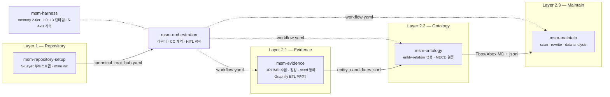

# MSM — Human-Agent KnowledgeBase Management System (v0.13.0)

MSM은 단순 Markdown scaffolding 도구가 아니다. 인간과 에이전트가 함께 운용하는 **KnowledgeBase 자체**를 관리하는 시스템이다. `ontology/`, `evidence/` 등 KB의 모든 구성 요소가 책임 범위다.

이 스킬셋은 **"Markdown 파일은 많이 쌓였는데, 그 안의 연결을 구조적으로 읽고 유지하고 확장하기가 어렵다"**는 문제를 풀기 위해 만들어졌다.

단일 문서 검색은 하나의 노트 안에 있는 정보만 돌려준다. 하지만 실제 인사이트는 여러 노드를 가로질러 존재한다. MSM은 frontmatter와 wikilink로 선언된 관계를 실제 그래프로 파싱하고, BFS 멀티홉 추론과 유지보수 레이어를 통해 **검색·추론·구조화·유지보수**를 하나의 skillset으로 다룬다.

---

## 설계 철학: Bounded Rationality, Calibrated Validation

우리는 언제나 제한된 정보와 시간 안에서 판단한다. 즉, 모든 의사결정은 제한된 합리성(Bounded Rationality) 위에서 이루어진다.

MSM은 이 전제를 기반으로, 무조건 깊은 검증이 아니라 인지 비용을 최소화하면서도 충분히 신뢰 가능한 판단을 가능하게 하는 구조를 지향한다. 검증 깊이를 고정하지 않고 Light · Medium · Deep 수준으로 조정 가능한 파라미터로 두며, 문제의 스케일과 의사결정 중요도에 따라 최적의 검증 수준을 선택한다.

> **기본 운영 원칙 (Narrative-first)**: 대부분의 사용자는 `evidence/` + `ontology/explain/`만으로 충분하다. `ontology/system/`(OWL/RDF formal logic)은 advanced layer — 도입 비용이 크므로 명시적 필요(기계 추론·SPARQL·외부 RDF 통합 등)가 있을 때만 사용한다.

---

## 기존 Markdown KB와 무엇이 다른가

|  | 기존 Markdown KB | MSM |
|--|-----------------|-----|
| **노드 출처** | 어디서 왔는지 불분명 | Evidence에서 ETL된 것만 Ontology로 승격 |
| **관계 정의** | 노트 안 wikilink 임의 연결 | `canonical_root_hub.yaml` 기반 명시적 관계 정의 |
| **그래프 탐색** | 모든 파일이 같은 계층 | 4계층(system/explain/evidence) 명시적 분리 |
| **온톨로지 구조** | 개념·인스턴스 구분 없음 | `ontology/explain/concept/` (TBox) · `ontology/explain/instance/` (ABox) 분리 |
| **부모-자식 관계** | 디렉토리만 있음, 부모 anchor 불분명 | `{name}__class.md` 부모 anchor + `belongs_to` 강제 |
| **단일 부모** | 없음, 무제한 belongs_to | D-2: 단일 부모, 다중 도메인 = `cross_reference` |
| **유지보수** | 낡은 노트·중복·semantic drift 수동 정리 | `msm-maintain`이 scan/rewrite/eval 루프 제공 |
| **워크플로우** | 스킬에 내장 | `workflow/*.yaml`로 외부화, 스킬이 yaml 소비 |
| **외부 코드 수집** | 수동 | Graphify ETL → concept 노드 자동 추출·승격 |
| **지식 신뢰도** | draft와 validated 구분 없음 | `status: raw → draft → experimental → validated` 승격 모델 |
| **거버넌스** | 없음 | 5-Axis (비결정성·궤적·오라클·비용·HITL) 계측 |

---

## 5-Layer 아키텍처

```
Layer 1 — Repository    canonical_root_hub.yaml · ontology/ · evidence/ · workflow/ · memory/
Layer 2 — Workflow      workflow/{category}/*.yaml → msm-evidence · msm-ontology · msm-maintain · explorer
Layer 3 — Memory        task-context/ · ontology-index/ (2-tier)
Layer 4 — Tool          skill 모듈 · MCP (ollama, obsidian, notion, github)
Layer 5 — Governance    5-Axis 계측 (msm-harness) + CC 계약·HITL 정책 (msm-orchestration)
```

**KB 구축 ETL 흐름:**
```
Evidence 수집           Ontology ETL                       Reasoning
(msm-evidence)    →    (msm-ontology)              →    (graph-multihop·zvec)
  URL / 로컬 MD              explain/concept                 BFS N-hop
  Graphify graph.json        explain/instance                시맨틱 검색
                             MECE + parent-alignment 검증
```

**Graphify ETL 흐름:**
```
graphify .                         # 코드베이스 → graph.json
    ↓ graphify_to_msm.py           # concept 노드 필터링 + god node → class_candidate
evidence/graphify/                 # entity/relation candidates
    ↓ msm-ontology                 # MECE + parent-alignment 검증 → explain/concept 승격
```

**KB 유지보수 흐름:**
```
Scan  →  Analyze  →  Rewrite  →  Report
(msm-maintain: drift · orphan · eval · rewrite loop)
```

**Instance Layer (v0.12.0):**
```
SQLite runtime.db  (기억 — OLTP)    DuckDB analytics  (사고 — OLAP)
  market_signal                        read_parquet('snapshots/*.parquet')
  industry_threat_cache                Capital metrics, ROI, token/attention
  ECA kinetic state                    Workflow 성과 분석
```
원칙: **SQLite로 살아가고, DuckDB로 생각한다.**

---

## 스킬 구성 (v0.12.0)

6개 스킬이 5-Layer에서 협업한다. `msm-orchestration`이 진입점이며, 서브스킬은 workflow yaml을 통해 on-demand로 실행된다.



| 스킬 | 역할 |
|------|------|
| `msm-repository-setup` | 5-Layer KB 디렉토리 골격 부트스트랩. `index.yaml` 자동 생성 (MSO 스키마 준수) |
| `msm-evidence` | URL/로컬 MD 수집·청킹 → `evidence/seeds.jsonl`. Graphify ETL 어댑터 포함 |
| `msm-ontology` | entity·relation 생성 + MECE + parent-alignment(D-1~D-7) 검증 → `ontology/explain/` 승격. **TBox·RBox·ABox 3층 OWL 추론** (RBox property chain 멀티홉 포함) |
| `msm-maintain` | orphan·drift 탐지, parent-alignment scan, 노트 rewrite, 통계 분석 |
| `msm-harness` | memory 2-tier 운영, L0~L3 런타임 라우팅, 5-Axis 계측 |
| `msm-orchestration` | 자연어 인텐트 → workflow yaml 라우팅, CC 계약, HITL 2층 설계 |
| `msm-instance` _(v0.12.0)_ | SQLite OLTP + DuckDB OLAP 하이브리드. `init/insert/query/migrate/export-snapshot` |
| `msm-obsidian-projection` _(v0.12.0)_ | DuckDB → Obsidian MD + .base generated layer |

### 스킬 라우팅

| 요청 유형 | 담당 스킬 |
|----------|----------|
| 새 KB 부트스트랩 | `msm-repository-setup` |
| URL / 로컬 MD evidence 수집 | `msm-evidence` |
| Graphify 코드베이스 수집 | `msm-evidence` (`graphify_to_msm.py`) |
| entity·relation 생성·MECE 검증 | `msm-ontology` |
| KB 유지보수·rewrite·분석 | `msm-maintain` |
| Instance DB 조작 | `msm-instance` |
| Obsidian projection 생성 | `msm-obsidian-projection` |
| 워크플로우 라우팅·HITL 판정 | `msm-orchestration` |
| 5-Axis 계측·메모리·런타임 | `msm-harness` |

---

## MSO 스키마 정렬

MSM v0.12.0부터 MSO(Multi-Swarm Orchestrator) 스키마를 준수한다.

- `index.yaml` — mso-scaffold-design 스키마 준수 (`sf_node.py validate`)
- `*-workflow.yaml` — mso-workflow-design 스키마 준수 (`wf_node.py validate`)
- `msm init` 시 `index.yaml` 자동 생성·갱신 (`gen_index.py`)

---

## 설치

```bash
git clone https://github.com/WMJOON/markdown-scaffolding-multihop.git
cd markdown-scaffolding-multihop
./install.sh                # Claude Code만
./install.sh --codex        # Codex만
./install.sh --antigravity  # Antigravity만
./install.sh --all          # Claude Code + Codex + Antigravity
```

### Quick Start

```bash
# 1) 새 KB 부트스트랩
skills/msm-repository-setup/scripts/msm init \
  --target my-kb --domain ai_agent --apply --yes

# 2) evidence 수집
skills/msm-evidence/scripts/msm-evidence collect \
  --target my-kb --source https://example.com/paper.pdf --apply

# 3) Graphify ETL (코드베이스 → KB)
graphify .
python skills/msm-evidence/scripts/graphify_to_msm.py \
  graphify-out/graph.json --output-dir my-kb/evidence/graphify/

# 4) 자연어 라우팅
skills/msm-orchestration/msm-orchestrate run \
  --intent "evidence 수집 후 ontology 반영해줘" \
  --target my-kb --tier L0 --mode dry-run
```

---

## 문서

| 문서 | 설명 |
|------|------|
| [빠른 시작](docs/guides/quickstart.md) | 설치, 지원 소스, 기본 명령어 |
| [온톨로지 설정](docs/guides/ontology-config.md) | canonical_root_hub.yaml, Tbox/Abox 구조 |
| [KB 디렉토리 구조](docs/kb-directory-structure.md) | 5-Layer 구조, ETL 흐름, 상태 모델 |
| [KB 구축 흐름](docs/guides/kb-build-flows.md) | Top-Down / Bottom-Up 전략, Graphify ETL |
| [워크플로우](docs/guides/workflows.md) | workflow yaml 카테고리, 스킬 바인딩 |
| [KB 유지보수](docs/guides/kb-maintenance.md) | scan/rewrite/eval 루프 |
| [스킬 구성](docs/skills.md) | 전체 스킬 목록, 역할, 레퍼런스 링크 |
| [Changelog](docs/changelog.md) | 전체 버전별 변경 이력 |

---

## Roadmap

```text
v0.1.x  Evidence-first KB 구조 정립                              ✓ 완료
v0.2.x  rewrite/governance/semantic framing 레이어               ✓ 완료
v1.0.0  5-Layer 아키텍처 · 6개 스킬 · Graphify ETL              ✓ 완료
v1.0.1  Antigravity 플랫폼 지원                                  ✓ 완료
v1.1.0  Parent Alignment · 4계층 KB 구조 (D-1~D-7)              ✓ 완료
v1.1.1  Concept HITL · Instance 차등 자동화 정책 문서화          ✓ 완료
v0.12.0  Instance Layer (SQLite+DuckDB) · ECA Kinetic · MSO 정렬  ✓ 완료
        msm-instance · msm-obsidian-projection 신규
        index.yaml 자동 생성 · workflow YAML MSO 스키마 준수
v0.12.1  msm-ontology v0.14.0 — SHACL `shapes-validate` 도입       ✓ 완료
        contract-validate stub 폐기 · pyshacl + rdflib venv
        Tbox 구조 검증 (inference=none) · my-knowledge-base 파일럿 패턴 이식
v0.13.0  msm-ontology RBox — Role/Property 1급 레이어 (스킬 v0.14.0)  ← 현재
        rbox add-relation/list/compile/validate · axiom property (chain/inverse/subPropertyOf)
        graph-diff 추론 캡처 → property chain 멀티홉이 inferred.jsonl 에 (이전 한계 해소)
v1.x    msm-graph-reasoning · msm-semantic-search 추가
```

---

## 의존성

```
Python 3.10+
pip install -r requirements.txt
graphifyy (선택)       # Graphify ETL 사용 시
ollama_mcp (선택)      # 로컬 모델 보조 레이어
```

## License

MIT
