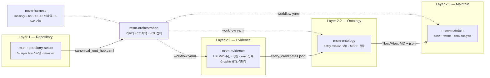

# MSM — Human-Agent KnowledgeBase Management System (v1.1.0)

> [!info] Identity
> **MSM**은 단순 Markdown scaffolding 도구가 아닙니다.
> 인간과 에이전트가 함께 운용하는 **KnowledgeBase 자체**를 관리하는 시스템입니다.
> `ontology/`, `evidence/` 등 KB의 모든 구성 요소가 책임 범위입니다.

이 스킬셋은 **"Markdown 파일은 많이 쌓였는데, 그 안의 연결을 구조적으로 읽고 유지하고 확장하기가 어렵다"**는 문제를 풀기 위해 만들어졌습니다.

단일 문서 검색은 하나의 노트 안에 있는 정보만 돌려줍니다. 하지만 실제 인사이트는 여러 노드를 가로질러 존재합니다. MSM은 frontmatter와 wikilink로 선언된 관계를 실제 그래프로 파싱하고, BFS 멀티홉 추론과 유지보수 레이어를 통해 **검색·추론·구조화·유지보수**를 하나의 skillset으로 다룹니다.

**v1.1.0** — Parent Node Alignment 내재화 및 4계층 KB 구조 도입.
- D-1: 부모 anchor `__class.md` 명명 통일 (구 `__hub.md`)
- D-2: 단일 부모 원칙 (다중 도메인은 `cross_reference`)
- D-3: 레벨 체계 L0~L4 권장, L5+ 자유
- D-4: 5축 분류 비강제
- D-5: `unclassified/` 디렉토리 운영
- D-6: TBox=Class / ABox=Instance 분리
- D-7: 4계층 ontology (`system/{semantic,kinetic,dynamic}` + `explain/{concept,instance}`) + `evidence/`

> [!tip] 기본 운영 원칙 (Narrative-first)
> **대부분의 사용자는 `evidence/` + `ontology/explain/`만으로 충분합니다.**
> `ontology/system/`(OWL/RDF formal logic)은 advanced layer — 도입 비용이 크므로 명시적 필요(기계 추론·SPARQL·외부 RDF 통합 등)가 있을 때만 사용. MSM 기본 모드는 자연어 우선.

**v1.0.1**은 v1.0.0 기반으로 Antigravity 플랫폼 지원을 추가했습니다. Claude Code · Codex · Antigravity 세 플랫폼 모두에서 MSM 스킬을 설치하고 실행할 수 있습니다. v1.0.0은 온톨로지 구축에 특화된 5-Layer 아키텍처로 전환한 버전이며, Repository · Workflow · Memory · Tool · Governance 5개 레이어 기반의 6개 스킬팩으로 재편했습니다.

---

## 설계 철학: Bounded Rationality, Calibrated Validation

> 우리는 언제나 제한된 정보와 시간 안에서 판단한다.
> 즉, 모든 의사결정은 제한된 합리성(Bounded Rationality) 위에서 이루어진다.
>
> markdown-scaffolding-multihop은 이 전제를 기반으로,
> 무조건 깊은 검증이 아니라 인지 비용을 최소화하면서도 충분히 신뢰 가능한 판단을 가능하게 하는 구조를 지향한다.
>
> 이를 위해 검증 깊이를 고정하지 않고
> Light · Medium · Deep 수준으로 조정 가능한 파라미터로 두며,
> 문제의 스케일과 의사결정 중요도에 따라 최적의 검증 수준을 선택해야 한다.

---

## 기존 Markdown KB와 무엇이 다른가

|  | 기존 Markdown KB | MSM |
|--|-----------------|-----|
| **노드 출처** | 어디서 왔는지 불분명 | Evidence에서 ETL된 것만 Ontology로 승격 |
| **관계 정의** | 노트 안 wikilink 임의 연결 | `canonical_root_hub.yaml` 기반 명시적 관계 정의 |
| **그래프 탐색** | 모든 파일이 같은 계층 | 4계층(system/explain/evidence) 명시적 분리 |
| **온톨로지 구조** | 개념·인스턴스 구분 없음 | `ontology/explain/concept/` (Class) · `ontology/explain/instance/` (Instance) 분리 |
| **부모-자식 관계** | 디렉토리만 있음, 부모 anchor 불분명 | `{name}__class.md` 부모 anchor + `belongs_to` 강제 |
| **단일 부모** | 없음, 무제한 belongs_to | D-2: 단일 부모, 다중 도메인 = `cross_reference` |
| **유지보수** | 낡은 노트·중복·semantic drift를 수동으로 정리 | `msm-maintain`이 scan(parent-alignment 포함)/rewrite/eval 루프 제공 |
| **워크플로우** | 스킬에 내장 | `workflow/*.yaml`로 외부화, 스킬이 yaml 소비 |
| **외부 코드 수집** | 수동 | Graphify ETL → concept 노드 자동 추출·승격 |
| **지식 신뢰도** | draft와 validated 구분 없음 | `status: raw → draft → experimental → validated` 승격 모델 |
| **거버넌스** | 없음 | 5-Axis (비결정성·궤적·오라클·비용·HITL) 계측 |

---

## 5-Layer 아키텍처

```
Layer 1 — Repository    canonical_root_hub.yaml · ontology/ · evidence/ · workflow/ · memory/
Layer 2 — Workflow      workflow/{category}/*.yaml → msm-evidence · msm-ontology · msm-maintain · explorer
Layer 3 — Memory        task-context/ · ontology-index/ (2-tier)
Layer 4 — Tool          skill 모듈 · MCP (ollama, obsidian, notion, github)
Layer 5 — Governance    5-Axis 계측 (msm-harness) + CC 계약·HITL 정책 (msm-orchestration)
```

**KB 구축 ETL 흐름:**
```
Evidence 수집           Ontology ETL                       Reasoning
(msm-evidence)    →    (msm-ontology)              →    (graph-multihop·zvec)
  URL / 로컬 MD              explain/concept                 BFS N-hop
  Graphify graph.json        explain/instance                시맨틱 검색
                             MECE + parent-alignment 검증
```

**Graphify ETL 흐름:**
```
graphify .                         # 코드베이스 → graph.json
    ↓ graphify_to_msm.py           # concept 노드 필터링 + god node → class_candidate
evidence/graphify/                 # entity/relation candidates
    ↓ msm-ontology                 # MECE + parent-alignment 검증 → explain/concept 승격
```

**KB 유지보수 흐름:**
```
Scan  →  Analyze  →  Rewrite  →  Report
(msm-maintain: drift · orphan · eval · rewrite loop)
```

---

## 스킬 구성 (v1.0.0)

6개 스킬이 5-Layer에서 협업합니다. `msm-orchestration`이 진입점이며, 서브스킬은 workflow yaml을 통해 on-demand로 실행됩니다.



### 스킬별 역할 요약

**`msm-repository-setup`** — 5-Layer KB 디렉토리 골격을 부트스트랩합니다. `msm init --target REPO --domain DOMAIN --apply` 한 번으로 `canonical_root_hub.yaml` · `ontology/` · `evidence/` · `workflow/` · `memory/` · `harness/`를 생성합니다.

**`msm-evidence`** — 외부 원본을 KB evidence로 수집합니다. URL/로컬 MD는 청킹 후 `evidence/seeds.jsonl`로 등록하고, Graphify `graph.json`은 `graphify_to_msm.py`로 concept 노드만 추출해 `evidence/graphify/entity_candidates.jsonl`로 변환합니다.

**`msm-ontology`** — entity·relation을 생성하고 MECE + parent-alignment(D-1~D-7)를 검증합니다. `evidence/` 후보를 받아 `ontology/explain/concept/` 또는 `ontology/explain/instance/`에 승격하고 `canonical_root_hub.yaml`을 갱신합니다. v1.1.0에서 `create-parent`, `add-belongs-to`, `move-to-unclassified` 명령 추가.

**`msm-maintain`** — KB 상태를 유지합니다. orphan / drift 탐지, **parent-alignment scan**(v1.1.0 신규), 노트 rewrite, 통계 분석을 담당합니다.

**`msm-harness`** — 측정·저장 레이어입니다. memory 2-tier 운영, L0~L3 런타임 라우팅, 5-Axis(비결정성·궤적·오라클·비용·HITL) 계측을 담당합니다.

**`msm-orchestration`** — 규범·정책 레이어입니다. 자연어 인텐트 → workflow yaml 라우팅, CC 계약, HITL 2층 설계, 5-Axis 임계치 판정을 담당합니다.

> **v1.x 예정**: `msm-graph-reasoning` (multi-hop·BFS·GraphRAG·RDF/OWL), `msm-semantic-search` (zvec·RRF)

### 스킬 라우팅

| 요청 유형 | 담당 스킬 |
|----------|----------|
| 새 KB 부트스트랩 | `msm-repository-setup` |
| URL / 로컬 MD evidence 수집 | `msm-evidence` |
| Graphify 코드베이스 수집 | `msm-evidence` (`graphify_to_msm.py`) |
| entity·relation 생성·MECE 검증 | `msm-ontology` |
| KB 유지보수·rewrite·분석 | `msm-maintain` |
| 워크플로우 라우팅·HITL 판정 | `msm-orchestration` |
| 5-Axis 계측·메모리·런타임 | `msm-harness` |

---

## 문서

| 문서 | 설명 |
|------|------|
| [빠른 시작](docs/guides/quickstart.md) | 설치, 지원 소스, 기본 명령어 |
| [온톨로지 설정](docs/guides/ontology-config.md) | canonical_root_hub.yaml, Tbox/Abox 구조 |
| [KB 디렉토리 구조](docs/kb-directory-structure.md) | 5-Layer 구조, ETL 흐름, 상태 모델 |
| [KB 구축 흐름](docs/guides/kb-build-flows.md) | Top-Down / Bottom-Up 전략, Graphify ETL |
| [워크플로우](docs/guides/workflows.md) | workflow yaml 카테고리, 스킬 바인딩 |
| [KB 유지보수](docs/guides/kb-maintenance.md) | scan/rewrite/eval 루프 |
| [스킬 구성](docs/skills.md) | 전체 스킬 목록, 역할, 레퍼런스 링크 |
| [Changelog](docs/changelog.md) | 전체 버전별 변경 이력 |

---

## 설치

```bash
git clone https://github.com/WMJOON/markdown-scaffolding-multihop.git
cd markdown-scaffolding-multihop
./install.sh                # Claude Code만
./install.sh --codex        # Codex만
./install.sh --antigravity  # Antigravity만
./install.sh --all          # Claude Code + Codex + Antigravity
```

`install.sh`는 진입점 스킬을 `~/.claude/skills/msm-orchestration`에 심링크합니다.

### Quick Start

```bash
# 1) 새 KB 부트스트랩
skills/msm-repository-setup/scripts/msm init \
  --target my-kb --domain ai_agent --apply --yes

# 2) evidence 수집
skills/msm-evidence/scripts/msm-evidence collect \
  --target my-kb --source https://example.com/paper.pdf --apply

# 3) Graphify ETL (코드베이스 → KB)
graphify .
python skills/msm-evidence/scripts/graphify_to_msm.py \
  graphify-out/graph.json --output-dir my-kb/evidence/graphify/

# 4) 자연어 라우팅
skills/msm-orchestration/msm-orchestrate run \
  --intent "evidence 수집 후 ontology 반영해줘" \
  --target my-kb --tier L0 --mode dry-run
```

---

## Roadmap

```text
v0.1.x  Evidence-first KB 구조 정립                              ✓ 완료
v0.2.x  rewrite/governance/semantic framing 레이어               ✓ 완료
v1.0.0  5-Layer 아키텍처 · 6개 스킬 · Graphify ETL              ✓ 완료
v1.0.1  Antigravity 플랫폼 지원                                  ✓ 완료
v1.1.0  Parent Alignment · 4계층 KB 구조 (D-1~D-7)              ← 현재
v1.2.0  ontology/system/ formal logic 도입 (advanced layer)
        ABox SPEC 확정 · explain ↔ system 매핑
v1.x    msm-graph-reasoning · msm-semantic-search 추가
```

---

## v1.2.0 방향성

> [!info] v1.2.0 = "formal logic은 선택적 advanced layer"
> v1.1.0은 모든 사용자가 즉시 운영 가능한 narrative-first KB를 완성했습니다.
> v1.2.0은 **선택적으로** formal logic 레이어를 추가합니다.
> **명시적 필요가 없는 사용자는 v1.1.0 그대로 사용해도 무방합니다.**

### 1. `ontology/system/` 채우기 (OWL/RDF formal logic)

| 서브 | 책임 | 예시 |
|------|------|------|
| **semantic/** | 정적 의미 관계·OWL class/property 정의 | `Class`, `subClassOf`, `domain/range` |
| **kinetic/** | 작용·변환·workflow의 형식 표현 | action ontology, transformation rules |
| **dynamic/** | 변화·시간성·event 시퀀스 | state-change, temporal logic, event sourcing |

→ 학습 비용이 큰 영역. **명시적 필요가 있을 때**만 도입 권장.

### 2. ABox SPEC 확정 (OI-E)

- `ontology/explain/instance/` 의 명명·디렉토리·frontmatter 규칙 확정
- `type_of: [[X__class]]` 관계 강제
- TBox class와 instance 간 1:N 매핑

### 3. `explain` ↔ `system` 매핑 (OI-A)

- 한 의미를 두 표현으로 — Markdown narrative + OWL formal
- 어떤 방식으로 매핑? (frontmatter cross-link / 별도 매핑 파일 / 자동 생성)

### 4. `system/` 도입 ROI 평가 (OI-F)

다음 use-case에서 `system/` 도입의 ROI 양수 여부 검증:
- 다중 에이전트 협업 (에이전트가 RDF 그래프로 공통 의미 공유)
- SPARQL 쿼리 (복잡한 multi-hop 추론)
- 외부 RDF 그래프 통합 (DBpedia, Wikidata 등)
- 형식 검증 (consistency check, classification)

→ **explain만으로 충분한 use-case**에서는 system 도입을 지양.

### 5. evidence ↔ ontology backref 자동화 (OI-D)

- evidence note → 인용한 ontology 노드 자동 backref
- ontology 노드 → 근거 evidence 자동 색인
- Sorcelink Rule의 양방향 강제

### 6. 미해결 결정 (OI-B, OI-C)

- **kinetic vs dynamic 경계**: workflow는 어디로? (작용=kinetic vs 변화=dynamic)
- **마이그레이션 시점**: system 룰 확정 후 한 번에 vs 점진적 도입

---

### v1.2.0 비목표

- 기존 v1.1.0 KB 강제 마이그레이션 (선택적)
- `explain/` 사용자에게 `system/` 학습 강요
- 모든 노드에 OWL 형식 표현 의무화

→ v1.2.0은 **추가 가능 옵션**이지 **기본 변경**이 아닙니다.

---

## 의존성

- Python 3.10+
- `pip install -r requirements.txt`
- 선택적: `graphifyy` (`pip install graphifyy`) — Graphify ETL 사용 시
- 선택적 보조 레이어: `ollama_mcp` + Ollama 로컬 모델

## License

MIT
