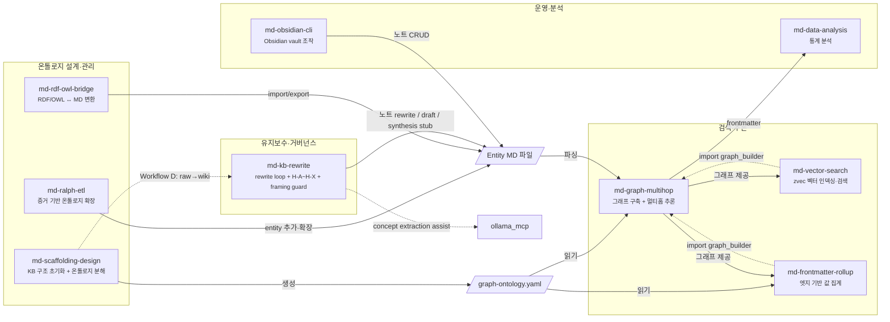

# markdown-scaffolding-multihop (v0.1.4)

이 스킬셋은 **"Markdown 파일은 많이 쌓였는데, 그 안의 연결을 구조적으로 읽고 유지하고 확장하기가 어렵다"** 는 문제를 풀기 위해 만들어졌습니다.

단일 문서 검색은 하나의 노트 안에 있는 정보만 돌려줍니다. 하지만 실제 인사이트는 여러 노트를 가로질러 존재합니다. A가 B를 참조하고, B가 C와 연결되며, C가 다시 A의 전제를 수정하는 식입니다. markdown-scaffolding-multihop은 frontmatter와 wikilink로 선언된 관계를 실제 그래프로 파싱하고, BFS 멀티홉 추론과 유지보수 레이어를 통해 **검색·추론·구조화·유지보수**를 하나의 skillset으로 다룹니다.

v0.1.4부터는 단순 GraphRAG/ETL 툴셋을 넘어, **KB를 오래 쓸수록 더 어려워지는 entropy 문제**까지 다루기 위해 `md-kb-rewrite`를 명시적인 maintenance/governance wrapper layer로 포함합니다. 또한 `ollama_mcp` 연동을 통해 반복적·저위험 작업 일부를 로컬 경량 모델에 위임하는 운영 패턴을 README 수준에서 공식화합니다.

---

## 설계 철학: Bounded Rationality, Calibrated Validation

> 우리는 언제나 제한된 정보와 시간 안에서 판단한다.
> 즉, 모든 의사결정은 제한된 합리성(Bounded Rationality) 위에서 이루어진다.
>
> markdown-scaffolding-multihop은 이 전제를 기반으로,
> 무조건 깊은 검증이 아니라 인지 비용을 최소화하면서도 충분히 신뢰 가능한 판단을 가능하게 하는 구조를 지향한다.
>
> 이를 위해 검증 깊이를 고정하지 않고
> Light · Medium · Deep 수준으로 조정 가능한 파라미터로 두며,
> 문제의 스케일과 의사결정 중요도에 따라 최적의 검증 수준을 선택해야 한다.
>
> 이 접근은 불필요한 reasoning 비용을 줄이면서도
> Decision Quality를 유지하거나 향상시키는 방향으로 작동한다.

---

## 기존 Markdown KB와 무엇이 다른가

평범한 Markdown 지식 베이스와 비교하면 이 프레임워크의 차이가 더 명확해집니다.

|  | 기존 Markdown KB | 이 프레임워크 |
|--|-----------------|--------------|
| **노드 출처** | 어디서 왔는지 불분명 | Evidence에서 ETL된 것만 Ontology로 승격 |
| **관계 정의** | 노트 안 wikilink 임의 연결 | `schema/relation/*.yaml` 또는 `graph-ontology.yaml` 기반의 명시적 관계 정의 |
| **그래프 탐색** | 모든 파일이 같은 계층 | `ontology/` ABox 중심 traversal, 나머지 레이어는 역할별 분리 |
| **유지보수** | 낡은 노트·중복·semantic drift를 수동으로 정리 | `md-kb-rewrite`가 heuristic rewrite loop + framing guardrail 제공 |
| **Obsidian 필터** | 태그·폴더 혼용 | `path:ontology/` → concept 노드만 정확히 반환 |
| **Neo4j 확장** | 별도 매핑 작업 필요 | `schema/` → relationship type 스키마 직접 매핑 가능 |
| **지식 신뢰도** | draft와 validated 구분 없음 | `status: raw → draft → experimental → validated` 승격 모델 |
| **로컬 보조 모델 사용** | 별도 운영 | `ollama_mcp`로 경량 개념 추출·초안 작성·후보 탐지 보조 가능 |

---

## 핵심 파이프라인

KB에 들어온 정보는 다음 흐름으로 처리됩니다. Evidence가 수집되고, 온톨로지로 구조화되고, 노드 간 링크가 설정되고, 멀티홉 추론에 활용되며, 시간이 지나면 유지보수 레이어가 entropy를 점검하고 rewrite / synthesis 후보를 다시 정렬합니다.


**KB 구축 ETL 흐름:**
```
Evidence 수집  →  Ontology ETL  →  Node Link  →  Validation 승격
(evidence/)       (ontology/)       (relations)    (status: validated)
```

**KB 유지보수 흐름:**
```
Detect  →  Diagnose  →  Draft  →  Review  →  Merge  →  Observe
(note entropy, drift, framing risk, missing synthesis)
```

---

## 레이어 구조

v0.1.4에서 이 skillset은 단순 기능 모음이 아니라 **레이어드 구조**로 이해하는 편이 더 정확합니다.

### Layer 1 — Structural / Retrieval / Transformation Layer
기존 markdown scaffolding 계열 스킬이 담당합니다.

역할:
- 그래프 구조 생성
- ETL
- 멀티홉 탐색
- 벡터 검색
- rollup
- RDF/OWL 변환

### Layer 2 — Maintenance / Governance / Semantic Framing Layer
`md-kb-rewrite`가 담당하는 wrapper layer입니다.

역할:
- rewrite candidate audit
- note drift detection
- evidence lag review
- semantic framing risk check
- low-risk refactor vs draft-only vs human-review 판단
- missing synthesis/article/concept 후보 탐지

이 두 레이어를 분리함으로써, 기존 구조 스킬은 구조 처리에 집중하고, KB의 장기 유지보수와 의미 보호는 별도의 wrapper layer가 맡게 됩니다.

---

## 스킬 구성

현재 9개 스킬이 4개 영역(온톨로지 설계 · 검색추론 · 유지보수 · 운영분석)에서 협업합니다. 각 스킬은 하나의 역할에 집중합니다.



### 스킬별 역할 요약

**검색·추론**

`md-graph-multihop` — KB 안에서 "A와 C가 어떻게 연결되는가?"처럼 여러 노드를 거쳐야 답이 나오는 질문에 씁니다. 그래프를 구축하고 BFS로 N-hop 서브그래프를 추출해 Claude가 구조적으로 추론할 수 있는 컨텍스트를 만듭니다.

`md-vector-search` — "이 개념과 의미상 가까운 노드가 뭔가?"처럼 키워드 매칭이 아닌 의미 기반 검색이 필요할 때 씁니다. zvec으로 벡터 인덱스를 만들고, 그래프 검색과 결합해 하이브리드 랭킹을 냅니다.

`md-frontmatter-rollup` — 하위 노드들의 숫자값(점수, 수치, 비율 등)을 상위 노드로 자동 집계할 때 씁니다. 엣지를 따라 sum/avg/weighted_avg/max/min/count를 수행합니다.

**온톨로지 설계·관리**

`md-scaffolding-design` — KB를 처음 만들거나 새 프로젝트에 그래프 구조를 심을 때 씁니다. `graph-ontology.yaml`을 자동 생성하고, Top-Down/Bottom-Up 구축 흐름을 지원합니다.

`md-ralph-etl` — URL이나 로컬 문서를 크롤링해서 KB에 새 증거 노드를 추가할 때 씁니다. 웹 페이지, 논문, 기사를 읽어 `evidence/[topic]/sources/`에 구조화된 노트로 넣습니다.

`md-rdf-owl-bridge` — 기존 RDF/OWL 지식 그래프를 MD-frontmatter 형식으로 변환하거나 반대로 내보낼 때 씁니다.

**유지보수·거버넌스**

`md-kb-rewrite` — KB가 오래되거나 지저분해졌을 때만 쓰는 단순 정리 스킬이 아닙니다. 이 스킬은 **maintenance/governance wrapper layer**로서, 6단계 rewrite loop와 H-A~H-X 휴리스틱으로 노트 품질 문제를 진단하고, semantic framing risk를 점검하고, missing synthesis/article 후보까지 탐지합니다. 필요 시 `ollama_mcp`와 연동해 개념 추출이나 경량 초안 생성을 보조시킵니다.

**운영·분석**

`md-obsidian-cli` — Claude가 Obsidian vault의 노트를 직접 읽고 쓰고 검색해야 할 때 씁니다. 노트 CRUD, 태그 검색, 플러그인 제어를 처리합니다.

`md-data-analysis` — frontmatter, CSV, JSON 형태로 쌓인 KB 데이터를 통계적으로 분석할 때 씁니다. 기술통계, 상관, 회귀, 시계열을 지원합니다.

### 스킬 간 의존 관계

| 소비자                     | 제공자                     | 계약 유형                                                  |
| ----------------------- | ----------------------- | ------------------------------------------------------ |
| `md-vector-search`      | `md-graph-multihop`     | **코드 import** — `graph_builder.build_graph()`, `nfc()` |
| `md-frontmatter-rollup` | `md-graph-multihop`     | **코드 import** — `graph_builder.build_graph()`, `nfc()` |
| `md-graph-multihop`     | `md-scaffolding-design` | **설정 파일** — `graph-config.yaml` 생성 → 소비                |
| `md-graph-multihop`     | `md-ralph-etl`          | **데이터** — entity MD 파일 추가/확장                           |
| `md-graph-multihop`     | `md-rdf-owl-bridge`     | **데이터** — RDF import → entity MD 파일 생성                 |
| `md-graph-multihop`     | `md-obsidian-cli`       | **데이터** — 노트 CRUD → entity MD 파일 변경                    |
| `md-data-analysis`      | `md-graph-multihop`     | **데이터** — frontmatter 추출 결과 분석 (느슨한 결합)                |
| `md-kb-rewrite`         | `md-scaffolding-design` | **워크플로우** — Workflow D raw→wiki 컴파일 연동                 |
| `md-kb-rewrite`         | `ollama_mcp`            | **보조 추론** — concept extraction / lightweight drafting |

---

## 워크플로우 A~D

스킬들은 상황에 따라 다른 조합으로 사용됩니다. 어떤 상황에서 시작하느냐에 따라 4가지 워크플로우 중 하나를 선택합니다.

### Workflow A — 새 KB를 처음 만드는 상황

"도메인은 정해졌는데 Markdown 구조가 아직 없다. 어디서부터 시작하지?"

이 상황에서 `md-scaffolding-design`을 실행합니다. 프로젝트 디렉토리나 GitHub repo를 분석해 `graph-ontology.yaml`을 자동 생성하고, `ontology/` · `schema/` · `evidence/` · `context/` · `docs/` 폴더 구조를 초기화합니다. 프리셋(personal-memory, obsidian-vault, git-repo 등)을 사용하면 즉시 시작할 수 있습니다.

```bash
python3 scaffold_project.py --local ./my-docs --output ./graph-ontology.yaml
python3 scaffold_project.py --template obsidian-vault --output ./graph-ontology.yaml
```

### Workflow B — 추론 결과를 KB에 저장하는 상황

"Claude가 분석한 인사이트를 그냥 대화로 끝내지 않고, KB 노드로 남기고 싶다."

`md-scaffolding-design`의 `save_insight.py`를 씁니다. Claude의 추론 결과에 wikilink를 연결해 기존 그래프와 이어지는 노드로 저장합니다. 나중에 `md-graph-multihop`이 이 노드를 다시 추론 경로에 포함시킬 수 있습니다.

```bash
python3 save_insight.py --title "분석 제목" --content "..." --links "node-a,node-b" --config graph-ontology.yaml
```

### Workflow C — KB가 낡거나 지저분해진 상황

"노트가 너무 길어졌거나, 같은 내용이 여러 곳에 흩어졌거나, 새 논문을 추가했는데 기존 노드에 반영이 안 됐다."

`md-kb-rewrite`를 씁니다. H-A~H-X 휴리스틱으로 문제를 진단하고, 6단계 rewrite loop(Detect → Diagnose → Draft → Review → Merge → Observe)로 개선합니다. 위험도가 낮은 작업은 자동 반영, 높은 작업은 human review를 거칩니다.

추가로 v0.1.4부터는 H-X가 **interesting connection / missing synthesis** 후보도 탐지합니다. 즉 이 워크플로우는 단순 cleanup뿐 아니라 "아직 쓰이지 않은 article이나 concept가 있는가?"까지 점검합니다.

→ 상세 사용법: [KB 유지보수 가이드](docs/guides/kb-maintenance.md)

### Workflow D — Raw 소스를 Wiki 노드로 컴파일하는 상황

"클리핑해둔 문서, 논문 초록, 메모들이 `raw/` 폴더에 쌓여 있다. 이걸 KB 구조로 정리하고 싶다."

Karpathy의 "LLM Knowledge Bases" 접근에서 착안한 흐름입니다. `md-scaffolding-design`이 raw/ 디렉토리를 스캔하고, 각 문서를 `ontology/` 또는 `evidence/`로 분류·컴파일합니다. 저위험 초안 작성이나 개념 목록 추출은 `ollama_mcp`(로컬 Gemma)에게 위임할 수 있습니다.

```
raw/[topic]/source.md (status: raw)
  → ontology/[concept]/[instance].md (status: draft)
  → evidence/[topic]/sources/[source].md
```

---

## H-A~H-X 휴리스틱

KB 유지보수에서 쓰는 핵심 진단 규칙입니다. 각 규칙은 "이런 증상이 보이면 이렇게 개입하라"는 형태로 동작합니다.

| 코드 | 이름 | 왜 이 규칙이 필요한가 | 증상 | rewrite / action 유형 |
|------|------|---------------------|------|----------------------|
| H-A | Length | 노트가 길어질수록 읽히지 않고, 추론 컨텍스트도 낭비된다 | 문단 과다, heading depth 과다, summary 없이 본문만 비대 | summary rewrite, structure rewrite |
| H-B | Redundancy | 같은 내용이 여러 노드에 흩어지면 업데이트할 때 일부만 반영되는 불일치가 생긴다 | 같은 주장이 여러 노트에 반복, concept note가 사례 설명으로 오염 | dedupe rewrite, merge rewrite |
| H-C | Drift | 노트는 특정 역할(ontology/evidence/synthesis)을 가져야 한다. 역할이 섞이면 그래프 탐색이 오염된다 | ontology note가 evidence note처럼 변질, 문서 내용이 원래 역할과 어긋남 | type alignment rewrite |
| H-D | Link Mismatch | ontology 구조가 바뀌면 그걸 참조하는 article 노트들도 같이 업데이트해야 일관성이 유지된다 | 연결 노드끼리 설명 구조 불일치, ontology 변경 후 article은 예전 표현 그대로 | cross-note consistency rewrite |
| H-E | Evidence Freshness | 새 논문이나 근거가 추가됐는데 본문이 그걸 반영하지 않으면 KB가 낡은 지식을 검증된 것처럼 제공한다 | 새 evidence가 들어왔지만 본문이 업데이트 안 됨 | evidence-integrating rewrite |
| H-F | Readability | 아무리 정확해도 읽기 어려운 노트는 팀 공유나 Claude 추론에 쓰이지 못한다 | bold/heading/list 과다, 단락 없이 bullet만 나열, 팀 공유용인데 너무 압축적 | readability rewrite, format rewrite |
| H-G | Semantic Bias | 한 가지 관점만 반복되면 그게 "사실"처럼 굳어진다. 대안 해석이 사라지면 KB 전체가 편향된다 | single framing 고착, uncertainty collapse, semantic trace erasure, hand-back impossibility | framing rewrite, bias mitigation rewrite |
| H-X | Connection Candidate | 관련 있는 노트들이 연결 안 된 채 고립되면 멀티홉 추론이 그 연결을 놓친다. 동시에 아직 쓰이지 않은 synthesis 기회가 묻힌다 | wikilink 0개인 synthesis/article 노드, BFS에서 도달 불가 노드, concept cluster는 있는데 합성 노드 없음 | connection audit, stub draft, synthesis proposal |

> **H-X는 H-A~H-G와 다릅니다.** H-A~H-G는 기존 노트의 문제를 고치지만, H-X는 아직 쓰이지 않은 연결이나 article/concept 후보를 발견합니다.

---

## ollama_mcp 연동 (v0.1.4)

v0.1.4부터는 `ollama_mcp`를 README 수준에서 공식 지원 패턴으로 다룹니다.

### 왜 쓰는가

모든 유지보수/합성 작업을 Claude 같은 상위 모델에게 맡기면 비용도 커지고, 단순 반복 작업까지 고비용 reasoning 경로를 타게 됩니다. 반면 KB 유지보수에는 다음과 같은 **로컬 경량 보조 작업**이 꽤 많습니다.

- 노드 여러 개에서 개념 목록 추출
- 짧은 summary 초안 생성
- note cluster 공통 키워드 압축
- missing connection 후보 1차 탐지
- low-risk rewrite 초안 보조

이런 단계는 `ollama_mcp`로 위임하고, 최종 framing 판단이나 governance 판단은 상위 모델/인간 검토가 맡는 쪽이 더 자연스럽습니다.

### 권장 모델

현재 경량 보조 모델의 기본 가정은:
- **`gemma4:e4b`**

포지션:
- concept extraction worker
- lightweight semantic filtering worker
- draft condensation worker
- rewrite pre-pass worker

즉 main orchestrator brain이라기보다, **semantic condensation / extraction worker**에 가깝습니다.

### 대표 사용 패턴

1. **H-X Connection Candidate 탐지**
   - `ollama_extract_concepts`로 여러 노드의 핵심 개념 목록 추출
   - 상위 모델/Claude가 교차 분석해 gap, synthesis, missing node 후보 도출

2. **Rewrite pre-pass**
   - 긴 note를 로컬 모델이 먼저 summary draft로 압축
   - 상위 레이어가 semantic framing risk와 governance risk를 다시 검토

3. **Evidence freshness triage**
   - 새 evidence note와 기존 summary note 간 키워드/개념 차이를 1차 비교
   - 실제 의미 변경이 있는지는 상위 모델이 검토

### fallback 원칙

`ollama_mcp`가 연결되지 않았거나 오류가 나면:
- 상위 모델이 직접 노드 본문을 읽어 개념을 추출하고,
- 처리 대상 노드 수를 줄이며,
- 필요 시 사전 검색(obsidian search 등)으로 범위를 좁혀 토큰 낭비를 줄입니다.

즉 `ollama_mcp`는 필수 의존성이 아니라 **비용 절감과 반복 작업 위임을 위한 보조 레이어**입니다.

---

## KB 디렉토리 구조

```text
[kb-name]/
  ontology/        ← ABox: instance 노드 (Obsidian path:ontology/ 필터)
    [concept]/
      [instance].md
  schema/          ← TBox: type 정의 (Neo4j schema 소스, graph traversal 제외)
    relation/
    concept/
  evidence/        ← 근거·출처
    [topic]/
      sources/ · notes/ · claims/
  context/         ← 운영·정책
    planning/ · policies/ · validation/ · migration/ · comparison/
  workflow/        ← 실행 워크플로우
  docs/            ← 탐색·인덱스·템플릿 (graph traversal 제외)
    index/ · guides/ · templates/
```

→ [상세 가이드](docs/kb-directory-structure.md)

---

## v0.1.4 변경 이력

> md-kb-rewrite의 wrapper layer 성격을 명확히 하고, semantic framing guardrail / H-X / ollama_mcp 운영 패턴을 README 차원에서 공식화한 릴리스.

| 개선 영역 | v0.1.3 | v0.1.4 |
|-----------|--------|--------|
| README 포지셔닝 | GraphRAG/ETL 중심 설명 | **레이어 구조 명시** — structural layer + maintenance/governance layer |
| `md-kb-rewrite` 설명 | rewrite loop 중심 | **wrapper skill** + semantic framing + synthesis detection로 확대 |
| H-X | 연결 누락 휴리스틱 소개 | **interesting connection / missing synthesis** 후보까지 명시 |
| ollama | "ollama_mcp 연동" 간단 언급 | **ollama_mcp 전용 섹션 추가** — role, model, fallback, use patterns 명시 |
| Gemma | 간접 언급 | **`gemma4:e4b`를 경량 보조 기본 모델**로 문서화 |

상세: [Changelog](docs/changelog.md)

---

## 문서

| 문서 | 설명 |
| ---- | ---- |
| [빠른 시작](docs/guides/quickstart.md) | 설치, 지원 소스, 기본 명령어 |
| [온톨로지 설정](docs/guides/ontology-config.md) | graph-ontology.yaml, Morphism Extension, 설정 파일 |
| [KB 디렉토리 구조](docs/kb-directory-structure.md) | ABox/TBox 분리, ETL 흐름, 상태 모델, graph-config 연동 |
| [KB 구축 흐름](docs/guides/kb-build-flows.md) | Top-Down / Bottom-Up 전략, 검증 깊이 루브릭, 루프 탈출 조건 |
| [KB 유지보수](docs/guides/kb-maintenance.md) | Rewrite loop, H-A~H-X 휴리스틱, Workflow D, ollama_mcp 연동 |
| [스킬 구성](docs/skills.md) | 전체 스킬 목록, 역할, 레퍼런스 링크 |
| [Changelog](docs/changelog.md) | 전체 버전별 변경 이력 |

---

## Roadmap

```text
v0.1.x  개인 업무 환경 검증 — Evidence-first KB 구조 정립
v0.2.x  rewrite/governance/semantic framing 레이어 고도화
```

---

## 의존성

- Python 3.10+
- `pip install -r requirements.txt`
- 선택적 보조 레이어: `ollama_mcp` + Ollama 로컬 모델 (`gemma4:e4b` 권장)

## License

MIT
