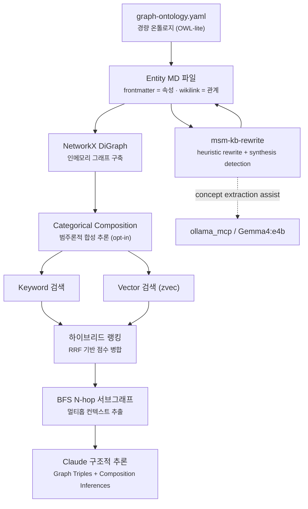
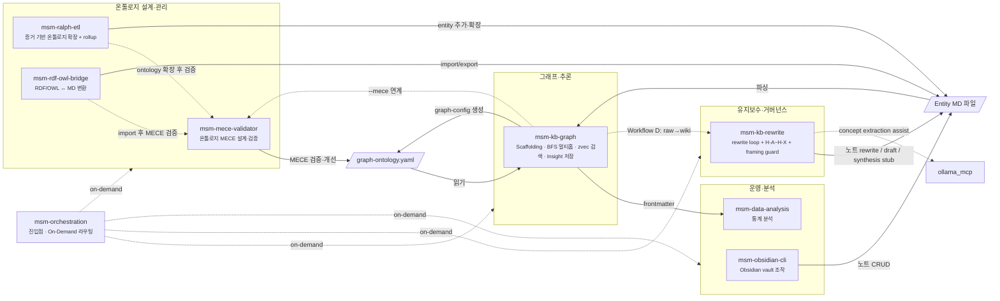

# markdown-scaffolding-multihop (v0.2.0)

이 스킬셋은 **"Markdown 파일은 많이 쌓였는데, 그 안의 연결을 구조적으로 읽고 유지하고 확장하기가 어렵다"**는 문제를 풀기 위해 만들어졌습니다.

단일 문서 검색은 하나의 노트 안에 있는 정보만 돌려줍니다. 하지만 실제 인사이트는 여러 노드를 가로질러 존재합니다. markdown-scaffolding-multihop은 frontmatter와 wikilink로 선언된 관계를 실제 그래프로 파싱하고, BFS 멀티홉 추론과 유지보수 레이어를 통해 **검색·추론·구조화·유지보수**를 하나의 skillset으로 다룹니다.

**v0.2.0은 스킬을 얇게 많이 두는 방식에서 굵게 적게 두는 방식으로 전환한 버전입니다.** 기존 10개 `md-*` 스킬을 7개 `msm-*` 스킬로 통합·재편했습니다. 역할이 겹치거나 단독으로는 워크플로우 완결성이 낮았던 스킬들을 흡수·병합해, 각 스킬이 더 넓은 범위를 맥락 전환 없이 스스로 해결할 수 있도록 두텁게 만들었습니다. `msm-kb-graph`는 그래프 구조 초기화·멀티홉 추론·벡터 검색·인사이트 저장을 단일 진입점으로 통합했고, `msm-ralph-etl`은 ETL과 집계(Rollup)를 함께 다룹니다. 함께 `msm-mece-validator`의 `--auto`/`--ollama` 플래그로 온톨로지 검증 루프를 완전 자동화하고, Ralph ETL 런타임 산출물을 git 이력에서 정화해 보안 기반도 정비했습니다.

> **현재 구조**: MSM 스킬셋은 `msm-orchestration`과 MSO 스킬셋의 `mso-orchestration`, 두 오케스트레이션 스킬을 진입점으로 두고 나머지 서브스킬을 on-demand로 로드하는 방식으로 운영된다. 향후 두 팩의 역할이 충분히 수렴하면 단일 Thick 스킬로 통합하는 방안을 검토 중이다.

---

## 설계 철학: Bounded Rationality, Calibrated Validation

> 우리는 언제나 제한된 정보와 시간 안에서 판단한다.
> 즉, 모든 의사결정은 제한된 합리성(Bounded Rationality) 위에서 이루어진다.
>
> markdown-scaffolding-multihop은 이 전제를 기반으로,
> 무조건 깊은 검증이 아니라 인지 비용을 최소화하면서도 충분히 신뢰 가능한 판단을 가능하게 하는 구조를 지향한다.
>
> 이를 위해 검증 깊이를 고정하지 않고
> Light · Medium · Deep 수준으로 조정 가능한 파라미터로 두며,
> 문제의 스케일과 의사결정 중요도에 따라 최적의 검증 수준을 선택해야 한다.

---

## 기존 Markdown KB와 무엇이 다른가

|  | 기존 Markdown KB | 이 프레임워크 |
|--|-----------------|--------------|
| **노드 출처** | 어디서 왔는지 불분명 | Evidence에서 ETL된 것만 Ontology로 승격 |
| **관계 정의** | 노트 안 wikilink 임의 연결 | `schema/relation/*.yaml` 또는 `graph-ontology.yaml` 기반의 명시적 관계 정의 |
| **그래프 탐색** | 모든 파일이 같은 계층 | `ontology/` 중심 traversal, 나머지 레이어는 역할별 분리 |
| **온톨로지 구조** | 개념·인스턴스 구분 없음 | `concept/[domain]/` (TBox-lite) · `instance/[domain]/` (ABox) 명시적 분리 |
| **유지보수** | 낡은 노트·중복·semantic drift를 수동으로 정리 | `msm-kb-rewrite`가 heuristic rewrite loop + framing guardrail 제공 |
| **Obsidian 필터** | 태그·폴더 혼용 | `path:ontology/` → concept·instance 노드만 정확히 반환 |
| **Neo4j 확장** | 별도 매핑 작업 필요 | `schema/` → relationship type 스키마 직접 매핑 가능 |
| **지식 신뢰도** | draft와 validated 구분 없음 | `status: raw → draft → experimental → validated` 승격 모델 |
| **로컬 보조 모델 사용** | 별도 운영 | `ollama_mcp`로 경량 개념 추출·초안 작성·후보 탐지 보조 가능 |

---

## 핵심 파이프라인



**KB 구축 ETL 흐름:**
```
Evidence 수집  →  Ontology ETL  →  Node Link  →  Validation 승격
(evidence/)       (ontology/)       (relations)    (status: validated)
```

**KB 유지보수 흐름:**
```
Detect  →  Diagnose  →  Draft  →  Review  →  Merge  →  Observe
(note entropy, drift, framing risk, missing synthesis)
```

---

## 레이어 구조

### Layer 1 — Structural / Retrieval / Transformation Layer

그래프 구조 생성, ETL, 멀티홉 탐색, 벡터 검색, rollup, RDF/OWL 변환.

### Layer 2 — Maintenance / Governance / Semantic Framing Layer

`msm-kb-rewrite`가 담당하는 wrapper layer. rewrite candidate audit, note drift detection, evidence lag review, semantic framing risk check, missing synthesis/article/concept 후보 탐지.

이 두 레이어를 분리함으로써, 구조 스킬은 구조 처리에 집중하고, KB의 장기 유지보수와 의미 보호는 별도 wrapper layer가 맡습니다.

---

## 스킬 구성

현재 7개 스킬이 4개 영역(온톨로지 설계 · 그래프추론 · 유지보수 · 운영분석)에서 협업합니다. `msm-orchestration`이 진입점이며, 서브스킬은 on-demand로 로드됩니다.



### 스킬별 역할 요약

**그래프·추론**

`msm-kb-graph` — KB 구조 초기화(Scaffolding), BFS 멀티홉 추론, zvec 시맨틱 검색, 인사이트 노드 저장을 하나의 스킬로 통합합니다. "새 프로젝트 그래프 세팅 → 멀티홉 질의 → 의미 기반 노드 탐색 → 결과 저장"을 단일 진입점으로 처리합니다.

**온톨로지 설계·관리**

`msm-mece-validator` — `graph-ontology.yaml`의 클래스·관계 구조가 MECE(상호배제·전체포괄)한지 검증하고 개선할 때 씁니다. Calibrated Validation 루프(light/medium/deep)로 리소스 투입량을 조절하며, `--auto` 플래그로 LLM 자동 답변 루프를, `--ollama` 플래그로 로컬 모델 단독 실행을 지원합니다. `msm-kb-graph`의 `--mece` 플래그로 연계 실행할 수 있습니다.

`msm-ralph-etl` — URL이나 로컬 문서를 크롤링해서 KB에 새 증거 노드를 추가할 때 씁니다. 웹 페이지, 논문, 기사를 읽어 `evidence/[domain]/sources/`에 구조화된 노트로 넣습니다. PDF URL 직접 처리(`step_pdf.py`)와 엣지 기반 값 집계(Frontmatter Rollup — sum/avg/weighted_avg/max/min/count)를 포함합니다.

`msm-rdf-owl-bridge` — 기존 RDF/OWL 지식 그래프를 MD-frontmatter 형식으로 변환하거나 반대로 내보낼 때 씁니다.

**유지보수·거버넌스**

`msm-kb-rewrite` — **maintenance/governance wrapper layer**로서, 6단계 rewrite loop와 H-A~H-X 휴리스틱으로 노트 품질 문제를 진단하고, semantic framing risk를 점검하고, missing synthesis/article 후보까지 탐지합니다. 필요 시 `ollama_mcp`와 연동해 개념 추출이나 경량 초안 생성을 보조시킵니다.

**운영·분석**

`msm-obsidian-cli` — Claude가 Obsidian vault의 노트를 직접 읽고 쓰고 검색해야 할 때 씁니다. 노트 CRUD, 태그 검색, 플러그인 제어를 처리합니다.

`msm-data-analysis` — frontmatter, CSV, JSON 형태로 쌓인 KB 데이터를 통계적으로 분석할 때 씁니다. 기술통계, 상관, 회귀, 시계열을 지원합니다.

### 스킬 간 의존 관계

| 소비자 | 제공자 | 계약 유형 |
|--------|--------|---------|
| `msm-kb-graph` (B/C/D) | `msm-kb-graph` (A) | **내부** — scaffold_project.py → graph-config.yaml 소비 |
| `msm-kb-graph` | `msm-ralph-etl` | **데이터** — entity MD 파일 추가/확장 |
| `msm-kb-graph` | `msm-rdf-owl-bridge` | **데이터** — RDF import → entity MD 파일 생성 |
| `msm-kb-graph` | `msm-obsidian-cli` | **데이터** — 노트 CRUD → entity MD 파일 변경 |
| `msm-data-analysis` | `msm-kb-graph` | **데이터** — frontmatter 추출 결과 분석 (느슨한 결합) |
| `msm-kb-rewrite` | `msm-kb-graph` | **워크플로우** — Workflow D raw→wiki 컴파일 연동 |
| `msm-kb-rewrite` | `ollama_mcp` | **보조 추론** — concept extraction / lightweight drafting |
| `msm-kb-graph` | `msm-mece-validator` | **스크립트 import** — `--mece` 플래그로 `mece_interview.py` 직접 호출 |
| `msm-rdf-owl-bridge` | `msm-mece-validator` | **워크플로우** — 외부 온톨로지 import 후 MECE 구조 재검증 |
| `msm-ralph-etl` | `msm-mece-validator` | **워크플로우** — Bottom-Up ETL로 새 클래스 추가 후 MECE 재검증 |

---

## 문서

| 문서 | 설명 |
|------|------|
| [빠른 시작](docs/guides/quickstart.md) | 설치, 지원 소스, 기본 명령어 |
| [온톨로지 설정](docs/guides/ontology-config.md) | graph-ontology.yaml, Morphism Extension, 설정 파일 |
| [KB 디렉토리 구조](docs/kb-directory-structure.md) | concept/instance 도메인 분리, ETL 흐름, 상태 모델 |
| [KB 구축 흐름](docs/guides/kb-build-flows.md) | Top-Down / Bottom-Up 전략, 검증 깊이 루브릭 |
| [워크플로우 A~D](docs/guides/workflows.md) | 상황별 스킬 조합, ollama_mcp 연동 패턴 |
| [KB 유지보수](docs/guides/kb-maintenance.md) | Rewrite loop, H-A~H-X 휴리스틱, Workflow D |
| [스킬 구성](docs/skills.md) | 전체 스킬 목록, 역할, 레퍼런스 링크 |
| [Changelog](docs/changelog.md) | 전체 버전별 변경 이력 |

---

## 설치

```bash
git clone https://github.com/WMJOON/markdown-scaffolding-multihop.git
cd markdown-scaffolding-multihop
./install.sh          # Claude Code만
./install.sh --codex  # Codex만
./install.sh --all    # Claude Code + Codex
```

`install.sh`는 두 가지를 생성한다:

| 생성 경로 | 내용 |
|----------|------|
| `~/.claude/skills/msm-orchestration` | 진입점 스킬 심링크 |
| `~/.skill-modules/msm-skills/` | 서브스킬 디렉토리 심링크 |

이미 같은 경로가 존재하면 건너뛰고 출력한다.

### 서브스킬 On-Demand 로딩

서브스킬은 `~/.skill-modules/msm-skills/`에 위치한다. 필요할 때 아래 경로를 Read 도구로 직접 읽으면 로드된다:

```
~/.skill-modules/msm-skills/SKILL_NAME/SKILL.md
```

`SKILL_NAME`을 아래 라우팅 테이블의 스킬명으로 교체한다.

### 스킬 라우팅

| 요청 유형 | 담당 스킬 |
|----------|----------|
| KB 데이터 분석 · 인사이트 추출 | `msm-data-analysis` |
| KB 그래프 구조 설계 · 멀티홉 추론 | `msm-kb-graph` |
| KB 노트 재작성 · 구조 유지보수 | `msm-kb-rewrite` |
| MECE 검증 · 온톨로지 구조 점검 | `msm-mece-validator` |
| Obsidian 파일 · 폴더 CLI 조작 | `msm-obsidian-cli` |
| Evidence ETL · Rollup 집계 | `msm-ralph-etl` |
| RDF/OWL 온톨로지 브릿지 | `msm-rdf-owl-bridge` |

**설치 확인**

```bash
python3 ~/.claude/skills/mso-skill-governance/scripts/validate_gov.py \
  --pack-root ~/.claude \
  --pack msm \
  --json
```

`"status": "ok"`, `"findings": []`이면 정상. (`mso-skill-governance`가 먼저 설치되어 있어야 한다.)

---

## Roadmap

```text
v0.1.x  개인 업무 환경 검증 — Evidence-first KB 구조 정립          ✓ 완료
v0.2.x  rewrite/governance/semantic framing 레이어 고도화           ← 현재
v0.3.x  멀티-도메인 KB 통합, 스킬 자동 갱신 루프
```

---

## 의존성

- Python 3.10+
- `pip install -r requirements.txt`
- 선택적 보조 레이어: `ollama_mcp` + Ollama 로컬 모델 (`qwen3.5:4b` 권장)

## License

MIT
