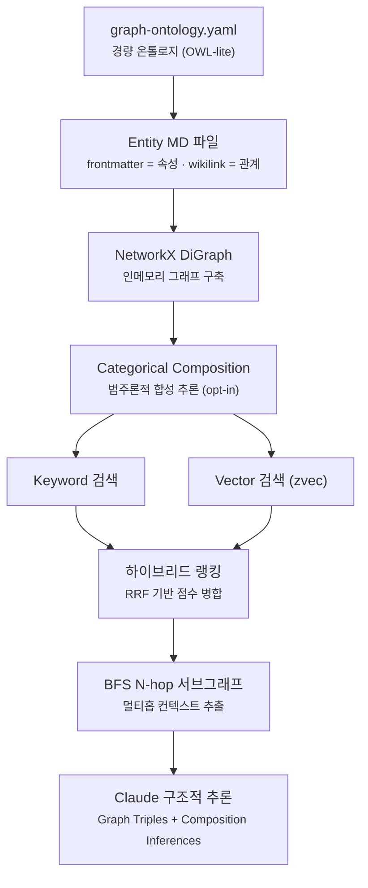
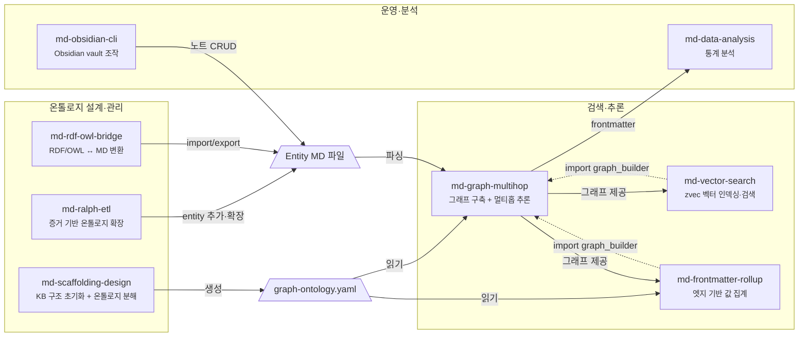

# markdown-scaffolding-multihop (v0.1.1)

frontmatter + wikilink로 선언한 엔티티·관계를 그래프로 파싱하고,
Graph + Vector 하이브리드 검색과 BFS 멀티홉 추론으로
단일 문서 검색으로는 도달할 수 없는 연결 인사이트를 도출한다.

---

## 설계 철학: Evidence-first, Structure-second

|  | 기존 Markdown KB | 이 프레임워크 |
|--|-----------------|--------------|
| **노드 출처** | 어디서 왔는지 불분명 | Evidence에서 ETL된 것만 Ontology로 승격 |
| **관계 정의** | 노트 안 wikilink 임의 연결 | `schema/relation/*.yaml` — TBox로 분리 정의 |
| **그래프 탐색** | 모든 파일이 같은 계층 | `ontology/` ABox만 traversal, 나머지 제외 |
| **Obsidian 필터** | 태그·폴더 혼용 | `path:ontology/` → concept 노드만 정확히 반환 |
| **Neo4j 확장** | 별도 매핑 작업 필요 | `schema/` → relationship type 스키마 직접 매핑 |
| **지식 신뢰도** | draft와 validated 구분 없음 | `status: draft → experimental → validated` 승격 모델 |

---

## 핵심 파이프라인



**KB 구축 ETL 흐름:**

```
Evidence 수집  →  Ontology ETL  →  Node Link  →  Validation 승격
(evidence/)       (ontology/)       (relations)    (status: validated)
```

---

## 스킬 계약 관계

8개 스킬이 온톨로지 설계·검색추론·운영분석 3개 영역에서 협업한다.



| 소비자 | 제공자 | 계약 유형 |
|--------|--------|-----------|
| `md-vector-search` | `md-graph-multihop` | **코드 import** — `graph_builder.build_graph()`, `nfc()` |
| `md-frontmatter-rollup` | `md-graph-multihop` | **코드 import** — `graph_builder.build_graph()`, `nfc()` |
| `md-graph-multihop` | `md-scaffolding-design` | **설정 파일** — `graph-config.yaml` 생성 → 소비 |
| `md-graph-multihop` | `md-ralph-etl` | **데이터** — entity MD 파일 추가/확장 |
| `md-graph-multihop` | `md-rdf-owl-bridge` | **데이터** — RDF import → entity MD 파일 생성 |
| `md-graph-multihop` | `md-obsidian-cli` | **데이터** — 노트 CRUD → entity MD 파일 변경 |
| `md-data-analysis` | `md-graph-multihop` | **데이터** — frontmatter 추출 결과 분석 (느슨한 결합) |

---

## KB 디렉토리 구조

```text
[kb-name]/
  ontology/        ← ABox: instance 노드 (Obsidian path:ontology/ 필터)
    [concept]/
      [instance].md
  schema/          ← TBox: type 정의 (Neo4j schema 소스, graph traversal 제외)
    relation/
    concept/
  evidence/        ← 근거·출처
    [topic]/
      sources/ · notes/ · claims/
  context/         ← 운영·정책
    planning/ · policies/ · validation/ · migration/ · comparison/
  workflow/        ← 실행 워크플로우
  docs/            ← 탐색·인덱스·템플릿 (graph traversal 제외)
    index/ · guides/ · templates/
```

→ [상세 가이드](docs/kb-directory-structure.md)

---

## 문서

| 문서                                           | 설명                                             |
| -------------------------------------------- | ---------------------------------------------- |
| [빠른 시작](docs/guides/quickstart.md)           | 설치, 지원 소스, 기본 명령어                              |
| [온톨로지 설정](docs/guides/ontology-config.md)    | graph-ontology.yaml, Morphism Extension, 설정 파일 |
| [KB 디렉토리 구조](docs/kb-directory-structure.md) | ABox/TBox 분리, ETL 흐름, 상태 모델, graph-config 연동   |
| [스킬 구성](docs/skills.md)                      | 전체 스킬 목록, 역할, 레퍼런스 링크                          |

---

## v0.1.1 변경 이력

> KB 구조 명세(SPEC)를 도입하고, Obsidian 기반 실제 KB에 검증 적용한 릴리스.

| 개선 영역 | 이전 | v0.1.1 |
|-----------|------|--------|
| KB 구조 | `ontology/` 안에 domain 폴더 혼재 | **ABox/TBox 분리** — `ontology/`(instance), `schema/`(type 정의) |
| Obsidian 필터 | `path:ontology/` 에 relation 파일 혼재 | `schema/` 분리로 `path:ontology/` 필터 정합성 확보 |
| Neo4j 확장 | 별도 매핑 작업 필요 | `schema/relation/*.yaml` → relationship type 직접 매핑 |
| docs 구조 | 없음 | `docs/index/ · guides/ · templates/` 신설 |
| 프리셋 | `obsidian-vault` 등 5종 | **`kb-structure` 프리셋 추가** — ABox/TBox 골격 자동 생성 |

상세: [SPEC v0.1.1](../planning/markdown-scaffolding-multihop_v0.1.1-SPEC.md)

---

## Roadmap

```
v0.1.x  개인 업무 환경 검증 — Evidence-first KB 구조 정립
```

---

## 의존성

- Python 3.10+
- `pip install -r requirements.txt`

## License

MIT
