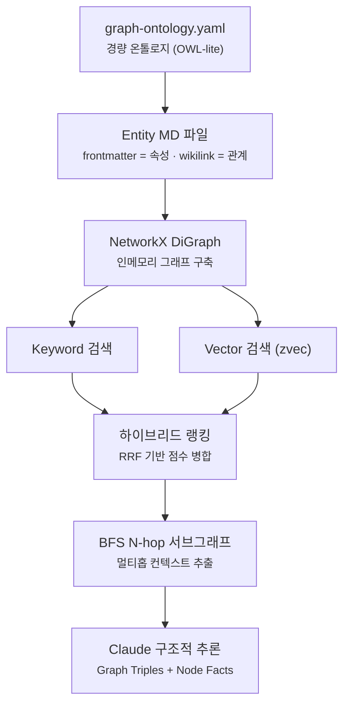
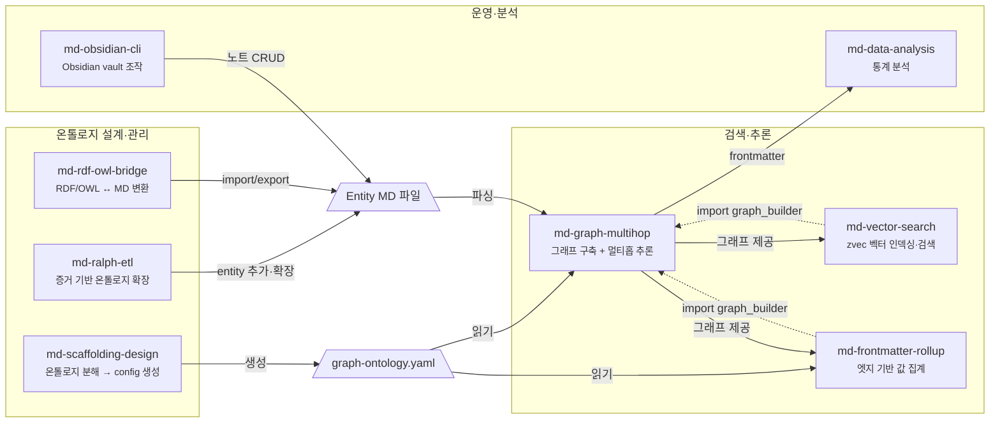

# markdown-scaffolding-multihop

**Markdown 기반 경량 온톨로지 프레임워크.**

frontmatter + wikilink로 선언한 엔티티·관계를 그래프로 파싱하고,
**Graph + Vector 하이브리드 검색**과 **BFS 멀티홉 추론**으로
단일 문서 검색으로는 도달할 수 없는 연결 인사이트를 도출한다.

외부 DB·API 키 없이 로컬에서 동작하며, `graph-ontology.yaml` 하나로
Obsidian vault·GitHub 레포·일반 Markdown 디렉토리에 모두 적용 가능하다.

## 핵심 파이프라인



## 스킬 계약관계



### 의존 요약

| 소비자 | 제공자 | 계약 유형 |
|--------|--------|-----------|
| `md-vector-search` | `md-graph-multihop` | **코드 import** — `graph_builder.build_graph()`, `nfc()` |
| `md-frontmatter-rollup` | `md-graph-multihop` | **코드 import** — `graph_builder.build_graph()`, `nfc()` |
| `md-graph-multihop` | `md-scaffolding-design` | **설정 파일** — `graph-config.yaml` 생성 → 소비 |
| `md-graph-multihop` | `md-ralph-etl` | **데이터** — entity MD 파일 추가/확장 → 그래프 변경 |
| `md-graph-multihop` | `md-rdf-owl-bridge` | **데이터** — RDF import → entity MD 파일 생성 |
| `md-graph-multihop` | `md-obsidian-cli` | **데이터** — 노트 CRUD → entity MD 파일 변경 |
| `md-data-analysis` | `md-graph-multihop` | **데이터** — frontmatter 추출 결과 분석 (느슨한 결합) |

## 스킬 구성

### 검색·추론

| 스킬 | 역할 |
|------|------|
| `md-graph-multihop` | 그래프 구축 + BFS 멀티홉 서브그래프 추출 + 키워드 노드 검색 |
| `md-vector-search` | zvec 벡터 인덱싱 + 시맨틱 노드 검색 + 하이브리드(Graph×Vector) 랭킹 |
| `md-frontmatter-rollup` | 엣지를 따라 frontmatter 값 집계 (sum/avg/weighted_avg/max/min/count) |

### 온톨로지 설계·관리

| 스킬 | 역할 |
|------|------|
| `md-scaffolding-design` | 온톨로지 분해(MECE Top-down + Bottom-up) → `graph-ontology.yaml` 자동 생성 |
| `md-rdf-owl-bridge` | RDF/OWL ↔ MD-frontmatter 양방향 변환 + KG 임베딩 + placement |
| `md-ralph-etl` | URL/로컬 문서 크롤링 → 증거 기반 온톨로지 확장 ETL |

### 운영·분석

| 스킬 | 역할 |
|------|------|
| `md-obsidian-cli` | Obsidian vault CLI 조작 (노트 CRUD, 검색, 플러그인 제어) |
| `md-data-analysis` | frontmatter / CSV / JSON 통계 분석 (기술통계, 상관, 회귀, 시계열) |

## 빠른 시작

```bash
pip install -r requirements.txt

# 1. 온톨로지 초기화
python3 skills/md-scaffolding-design/scripts/scaffold_project.py \
  --local ./my-docs --template obsidian-vault --output graph-config.yaml

# 2. 그래프 구축 확인
python3 skills/md-graph-multihop/scripts/graph_builder.py

# 3-a. 키워드 검색 + 멀티홉 추론
python3 skills/md-graph-multihop/scripts/graph_rag.py \
  --query "X와 Y의 관계는?" --hops 2 --context-only

# 3-b. 벡터 인덱싱 → 시맨틱 검색
python3 skills/md-vector-search/scripts/zvec_graph_index.py index
python3 skills/md-vector-search/scripts/zvec_graph_index.py search "시장 진입 전략"

# 4. 롤업 (값 집계)
python3 skills/md-frontmatter-rollup/scripts/rollup_engine.py --dry-run
```

## 온톨로지 설정

### graph-ontology.yaml (권장)

OWL-lite 스타일 단일 진실 소스. 엔티티 클래스, 관계, 스칼라 속성, 집계 규칙을 한 파일에 선언한다.

```yaml
classes:
  Industry:
    entity_dir: data/industry-entities
  Competitor:
    entity_dir: data/competitor-entities

object_properties:
  targetsIndustry:
    domain: Competitor
    range: Industry
    relation_name: targets_industry

datatype_properties:
  name:
    domain: [Industry, Competitor]
    range: xsd:string
```

`graph-config.yaml` + `rollup-config.yaml`은 이 파일에서 자동 도출된다.
전체 예시 → `graph-ontology.example.yaml`

### 설정 파일 요약

| 파일 | 역할 |
|------|------|
| `graph-ontology.yaml` | OWL-lite 단일 진실 소스 (권장) |
| `graph-config.yaml` | entity_dirs / relation_map / scalar_node_attrs (레거시 호환) |
| `rollup-config.yaml` | 집계 규칙 (레거시 호환) |

## 지원 소스

| 소스 | 설명 |
|------|------|
| **로컬 디렉토리** | 모든 Markdown 파일 (Obsidian vault 포함) |
| **GitHub 레포** | GitHub API 경유, 로컬 클론 불필요 |
| **Git 레포 (로컬)** | git clone 후 로컬 파일로 처리 |

## 디렉토리 구조

```
repository/
├── README.md
├── requirements.txt
├── graph-ontology.example.yaml
├── skills/
│   ├── md-graph-multihop/           # 그래프 구축 + 멀티홉 추론
│   ├── md-vector-search/            # zvec 벡터 검색 (하이브리드 노드 탐색)
│   ├── md-scaffolding-design/       # 온톨로지 설계 + 결과 저장
│   ├── md-frontmatter-rollup/       # frontmatter 값 집계
│   ├── md-rdf-owl-bridge/           # RDF/OWL 양방향 변환
│   ├── md-ralph-etl/                # 증거 기반 온톨로지 확장 ETL
│   ├── md-obsidian-cli/             # Obsidian vault CLI
│   └── md-data-analysis/            # 통계 분석 패키지
└── tests/
```
