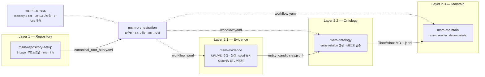

# markdown-scaffolding-multihop (v1.0.1)

이 스킬셋은 **"Markdown 파일은 많이 쌓였는데, 그 안의 연결을 구조적으로 읽고 유지하고 확장하기가 어렵다"**는 문제를 풀기 위해 만들어졌습니다.

단일 문서 검색은 하나의 노트 안에 있는 정보만 돌려줍니다. 하지만 실제 인사이트는 여러 노드를 가로질러 존재합니다. markdown-scaffolding-multihop은 frontmatter와 wikilink로 선언된 관계를 실제 그래프로 파싱하고, BFS 멀티홉 추론과 유지보수 레이어를 통해 **검색·추론·구조화·유지보수**를 하나의 skillset으로 다룹니다.

**v1.0.1은 v1.0.0 기반으로 Antigravity 플랫폼 지원을 추가한 버전입니다.** Claude Code · Codex · Antigravity 세 플랫폼 모두에서 MSM 스킬을 설치하고 실행할 수 있습니다. v1.0.0은 온톨로지 구축에 특화된 5-Layer 아키텍처로 전환한 버전이며, 기존 v0.x의 `md-*` / `msm-*` 스킬 구조를 해체하고, Repository · Workflow · Memory · Tool · Governance 5개 레이어 기반의 6개 스킬팩으로 완전 재편했습니다. 모든 스킬은 `skills/` 디렉토리에 위치하며(`.skill-modules/` 정책 폐지), 외부 코드베이스를 MSM KB로 수집하는 Graphify ETL 어댑터(`msm-evidence`)가 추가되었습니다.

---

## 설계 철학: Bounded Rationality, Calibrated Validation

> 우리는 언제나 제한된 정보와 시간 안에서 판단한다.
> 즉, 모든 의사결정은 제한된 합리성(Bounded Rationality) 위에서 이루어진다.
>
> markdown-scaffolding-multihop은 이 전제를 기반으로,
> 무조건 깊은 검증이 아니라 인지 비용을 최소화하면서도 충분히 신뢰 가능한 판단을 가능하게 하는 구조를 지향한다.
>
> 이를 위해 검증 깊이를 고정하지 않고
> Light · Medium · Deep 수준으로 조정 가능한 파라미터로 두며,
> 문제의 스케일과 의사결정 중요도에 따라 최적의 검증 수준을 선택해야 한다.

---

## 기존 Markdown KB와 무엇이 다른가

|  | 기존 Markdown KB | 이 프레임워크 |
|--|-----------------|--------------|
| **노드 출처** | 어디서 왔는지 불분명 | Evidence에서 ETL된 것만 Ontology로 승격 |
| **관계 정의** | 노트 안 wikilink 임의 연결 | `canonical_root_hub.yaml` 기반 명시적 관계 정의 |
| **그래프 탐색** | 모든 파일이 같은 계층 | Tbox/Abox 명시적 분리, 역할별 레이어 |
| **온톨로지 구조** | 개념·인스턴스 구분 없음 | `ontology/Tbox/` (클래스·관계) · `ontology/Abox/` (인스턴스) 분리 |
| **유지보수** | 낡은 노트·중복·semantic drift를 수동으로 정리 | `msm-maintain`이 scan/rewrite/eval 루프 제공 |
| **워크플로우** | 스킬에 내장 | `workflow/*.yaml`로 외부화, 스킬이 yaml 소비 |
| **외부 코드 수집** | 수동 | Graphify ETL → concept 노드 자동 추출·승격 |
| **지식 신뢰도** | draft와 validated 구분 없음 | `status: raw → draft → experimental → validated` 승격 모델 |
| **거버넌스** | 없음 | 5-Axis (비결정성·궤적·오라클·비용·HITL) 계측 |

---

## 5-Layer 아키텍처

```
Layer 1 — Repository    canonical_root_hub.yaml · ontology/ · evidence/ · workflow/ · memory/
Layer 2 — Workflow      workflow/{category}/*.yaml → msm-evidence · msm-ontology · msm-maintain · explorer
Layer 3 — Memory        task-context/ · ontology-index/ (2-tier)
Layer 4 — Tool          skill 모듈 · MCP (ollama, obsidian, notion, github)
Layer 5 — Governance    5-Axis 계측 (msm-harness) + CC 계약·HITL 정책 (msm-orchestration)
```

**KB 구축 ETL 흐름:**
```
Evidence 수집           Ontology ETL              Reasoning
(msm-evidence)    →    (msm-ontology)    →    (graph-multihop·zvec)
  URL / 로컬 MD              Tbox/Abox               BFS N-hop
  Graphify graph.json        MECE 검증               시맨틱 검색
```

**Graphify ETL 흐름:**
```
graphify .                         # 코드베이스 → graph.json
    ↓ graphify_to_msm.py           # concept 노드 필터링 + god node → hub_candidate
evidence/graphify/                 # entity/relation candidates
    ↓ msm-ontology                 # MECE 검증 후 Tbox/Abox 승격
```

**KB 유지보수 흐름:**
```
Scan  →  Analyze  →  Rewrite  →  Report
(msm-maintain: drift · orphan · eval · rewrite loop)
```

---

## 스킬 구성 (v1.0.0)

6개 스킬이 5-Layer에서 협업합니다. `msm-orchestration`이 진입점이며, 서브스킬은 workflow yaml을 통해 on-demand로 실행됩니다.



### 스킬별 역할 요약

**`msm-repository-setup`** — 5-Layer KB 디렉토리 골격을 부트스트랩합니다. `msm init --target REPO --domain DOMAIN --apply` 한 번으로 `canonical_root_hub.yaml` · `ontology/` · `evidence/` · `workflow/` · `memory/` · `harness/`를 생성합니다.

**`msm-evidence`** — 외부 원본을 KB evidence로 수집합니다. URL/로컬 MD는 청킹 후 `evidence/seeds.jsonl`로 등록하고, Graphify `graph.json`은 `graphify_to_msm.py`로 concept 노드만 추출해 `evidence/graphify/entity_candidates.jsonl`로 변환합니다.

**`msm-ontology`** — entity·relation을 생성하고 MECE를 검증합니다. `evidence/` 후보를 받아 Tbox/Abox에 승격하고 `canonical_root_hub.yaml`을 갱신합니다.

**`msm-maintain`** — KB 상태를 유지합니다. orphan 탐지, drift 평가, 노트 rewrite, 통계 분석을 담당합니다.

**`msm-harness`** — 측정·저장 레이어입니다. memory 2-tier 운영, L0~L3 런타임 라우팅, 5-Axis(비결정성·궤적·오라클·비용·HITL) 계측을 담당합니다.

**`msm-orchestration`** — 규범·정책 레이어입니다. 자연어 인텐트 → workflow yaml 라우팅, CC 계약, HITL 2층 설계, 5-Axis 임계치 판정을 담당합니다.

> **v1.x 예정**: `msm-graph-reasoning` (multi-hop·BFS·GraphRAG·RDF/OWL), `msm-semantic-search` (zvec·RRF)

### 스킬 라우팅

| 요청 유형 | 담당 스킬 |
|----------|----------|
| 새 KB 부트스트랩 | `msm-repository-setup` |
| URL / 로컬 MD evidence 수집 | `msm-evidence` |
| Graphify 코드베이스 수집 | `msm-evidence` (`graphify_to_msm.py`) |
| entity·relation 생성·MECE 검증 | `msm-ontology` |
| KB 유지보수·rewrite·분석 | `msm-maintain` |
| 워크플로우 라우팅·HITL 판정 | `msm-orchestration` |
| 5-Axis 계측·메모리·런타임 | `msm-harness` |

---

## 문서

| 문서 | 설명 |
|------|------|
| [빠른 시작](docs/guides/quickstart.md) | 설치, 지원 소스, 기본 명령어 |
| [온톨로지 설정](docs/guides/ontology-config.md) | canonical_root_hub.yaml, Tbox/Abox 구조 |
| [KB 디렉토리 구조](docs/kb-directory-structure.md) | 5-Layer 구조, ETL 흐름, 상태 모델 |
| [KB 구축 흐름](docs/guides/kb-build-flows.md) | Top-Down / Bottom-Up 전략, Graphify ETL |
| [워크플로우](docs/guides/workflows.md) | workflow yaml 카테고리, 스킬 바인딩 |
| [KB 유지보수](docs/guides/kb-maintenance.md) | scan/rewrite/eval 루프 |
| [스킬 구성](docs/skills.md) | 전체 스킬 목록, 역할, 레퍼런스 링크 |
| [Changelog](docs/changelog.md) | 전체 버전별 변경 이력 |

---

## 설치

```bash
git clone https://github.com/WMJOON/markdown-scaffolding-multihop.git
cd markdown-scaffolding-multihop
./install.sh                # Claude Code만
./install.sh --codex        # Codex만
./install.sh --antigravity  # Antigravity만
./install.sh --all          # Claude Code + Codex + Antigravity
```

`install.sh`는 진입점 스킬을 `~/.claude/skills/msm-orchestration`에 심링크합니다.

### Quick Start

```bash
# 1) 새 KB 부트스트랩
skills/msm-repository-setup/scripts/msm init \
  --target my-kb --domain ai_agent --apply --yes

# 2) evidence 수집
skills/msm-evidence/scripts/msm-evidence collect \
  --target my-kb --source https://example.com/paper.pdf --apply

# 3) Graphify ETL (코드베이스 → KB)
graphify .
python skills/msm-evidence/scripts/graphify_to_msm.py \
  graphify-out/graph.json --output-dir my-kb/evidence/graphify/

# 4) 자연어 라우팅
skills/msm-orchestration/msm-orchestrate run \
  --intent "evidence 수집 후 ontology 반영해줘" \
  --target my-kb --tier L0 --mode dry-run
```

---

## Roadmap

```text
v0.1.x  Evidence-first KB 구조 정립                              ✓ 완료
v0.2.x  rewrite/governance/semantic framing 레이어               ✓ 완료
v1.0.0  5-Layer 아키텍처 · 6개 v1.0.0 스킬 · Graphify ETL       ← 현재
v1.x    msm-graph-reasoning · msm-semantic-search 추가
```

---

## 의존성

- Python 3.10+
- `pip install -r requirements.txt`
- 선택적: `graphifyy` (`pip install graphifyy`) — Graphify ETL 사용 시
- 선택적 보조 레이어: `ollama_mcp` + Ollama 로컬 모델

## License

MIT
