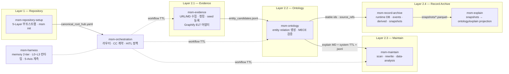

# MSM — Human-Agent KnowledgeBase Management System (v0.14.0)

> 명칭은 변경 예정인 가칭이다. 앞으로의 핵심 스코프는 **ontology knowledge base 구성**과 **AI 추론 경로 제약**이다. 일반 리서치 수집, 리포트 작성, 사용자-facing projection은 각 consumer repository의 MSO workflow와 일반 도구 구성이 담당한다.

MSM은 단순 Markdown scaffolding 도구가 아니다. 인간과 에이전트가 함께 운용하는 **KnowledgeBase 자체**를 관리하는 시스템이다. `ontology/`, `evidence/` 등 KB의 모든 구성 요소가 책임 범위다.

이 스킬셋은 **"Markdown 파일은 많이 쌓였는데, 그 안의 연결을 구조적으로 읽고 유지하고 확장하기가 어렵다"**는 문제를 풀기 위해 만들어졌다.

단일 문서 검색은 하나의 노트 안에 있는 정보만 돌려준다. 하지만 실제 인사이트는 여러 노드를 가로질러 존재한다. MSM은 frontmatter와 wikilink로 선언된 관계를 실제 그래프로 파싱하고, BFS 멀티홉 추론과 유지보수 레이어를 통해 **검색·추론·구조화·유지보수**를 하나의 skillset으로 다룬다.

MSM의 KB 탐색은 키워드 검색만으로 종료하지 않는다. 기본 레일은 **lexical seed → semantic expansion → graph/line validation**이다. `rg`는 정확한 표면어와 파일 위치를 빠르게 찾는 seed 단계이고, `zvec`은 표면어가 다른 인접 개념·사례·근거를 확장하는 의미 검색 단계다. 최종 답변과 ontology 변경은 반드시 원문 파일/라인 또는 evidence seed로 다시 검증한다.

---

## 설계 철학: Bounded Rationality, Calibrated Validation

우리는 언제나 제한된 정보와 시간 안에서 판단한다. 즉, 모든 의사결정은 제한된 합리성(Bounded Rationality) 위에서 이루어진다.

MSM은 이 전제를 기반으로, 무조건 깊은 검증이 아니라 인지 비용을 최소화하면서도 충분히 신뢰 가능한 판단을 가능하게 하는 구조를 지향한다. 검증 깊이를 고정하지 않고 Light · Medium · Deep 수준으로 조정 가능한 파라미터로 두며, 문제의 스케일과 의사결정 중요도에 따라 최적의 검증 수준을 선택한다.

> **기본 운영 원칙 (Narrative-first)**: 대부분의 사용자는 `evidence/` + `ontology/explain/`만으로 충분하다. `ontology/system/`(OWL/RDF formal logic)은 advanced layer — 도입 비용이 크므로 명시적 필요(기계 추론·SPARQL·외부 RDF 통합 등)가 있을 때만 사용한다.

---

## v0.14.0 Semantic Relation · Axiom Governance

v0.14.0의 핵심은 **KB를 더 많이 찾는 것**이 아니라, 찾은 근거로부터 **어떤 관계와 공리를 안전하게 제안할 수 있는지**를 통제하는 것이다.

- `rg lexical seed → zvec semantic expansion → graph traversal → source validation`을 KB 탐색 기본 레일로 고정한다.
- `msm-semantic-search`가 zvec index를 만들고, 의미상 인접한 노트·근거 chunk를 후보로 확장한다.
- `link-relations`는 chunk 내용을 읽어 `implements`, `depends_on`, `enables`, `part_of` 같은 directed relation 후보를 생성한다.
- relation 후보는 `evidence/semantic-link/relation_candidates.jsonl` review queue로만 생성한다.
- 공리 후보는 `evidence/semantic-link/axiom_candidates.jsonl` review queue로 분리한다.
- relation/axiom은 L0~L5 risk tier로 나누며, L2 이상은 자동 적용하지 않는다.
- `disjointWith`, `propertyChain`, `classification_rule` 같은 graph-wide inference 공리는 HITL과 inference preview 없이는 승격할 수 없다.

---

## 기존 Markdown KB와 무엇이 다른가

|  | 기존 Markdown KB | MSM |
|--|-----------------|-----|
| **노드 출처** | 어디서 왔는지 불분명 | Evidence/candidate queue에 먼저 적재하고 검증된 것만 Ontology로 승격 |
| **관계 정의** | 노트 안 wikilink 임의 연결 | `canonical_root_hub.yaml` 기반 명시적 관계 정의 |
| **그래프 탐색** | 모든 파일이 같은 계층 | 4계층(system/explain/evidence) 명시적 분리 |
| **온톨로지 구조** | 개념·인스턴스 구분 없음 | `ontology/explain/concept/` (TBox) · `ontology/explain/instance/` (ABox) 분리 |
| **부모-자식 관계** | 디렉토리만 있음, 부모 anchor 불분명 | `{name}__class.md` 부모 anchor + `belongs_to` 강제 |
| **단일 부모** | 없음, 무제한 belongs_to | D-2: 단일 부모, 다중 도메인 = `cross_reference` |
| **유지보수** | 낡은 노트·중복·semantic drift 수동 정리 | `msm-maintain`이 scan/rewrite/eval 루프 제공 |
| **워크플로우** | 스킬에 내장 | `agent-context/workflow/*.abox.ttl`로 외부화, YAML은 migration layer |
| **외부 코드 수집** | 수동 | Graphify ELT adapter → concept 후보 적재·검증 후 승격 |
| **지식 신뢰도** | draft와 validated 구분 없음 | `status: raw → draft → experimental → validated` 승격 모델 |
| **거버넌스** | 없음 | 5-Axis (비결정성·궤적·오라클·비용·HITL) 계측 |

---

## 5-Layer 아키텍처

| Layer | 책임 | 핵심 구성 |
|-------|------|-----------|
| Layer 1 — Repository | KB 저장소 구조와 정본 anchor | `canonical_root_hub.yaml`, `ontology/`, `evidence/`, `record-archive/`, `agent-context/` |
| Layer 2 — Workflow | KB 구축·탐색·유지보수 실행 레일 | `agent-context/workflow/{category}/*.abox.ttl`, `msm-evidence`, `msm-ontology`, `msm-maintain`, explorer |
| Layer 3 — Memory | 작업 맥락과 ontology index 운영 | `task-context/`, `ontology-index/` 2-tier |
| Layer 4 — Tool | skill module과 외부 도구 adapter | skill 모듈, MCP (`ollama`, `obsidian`, `notion`, `github`) |
| Layer 5 — Governance | 계측, 계약, HITL 정책 | 5-Axis 계측 (`msm-harness`), CC 계약·HITL 정책 (`msm-orchestration`) |

**KB 구축 ELT 흐름:**

| 단계 | 담당 | 입력 | 산출/저장 위치 | 승격 조건 |
|------|------|------|----------------|-----------|
| Extract | `msm-evidence`, `graphify_to_msm.py`, `msm-semantic-search` | URL, 로컬 MD, Graphify `graph.json`, 기존 ontology registry | 원문·chunk·entity/relation 후보 | 원문과 후보를 보존하고 정본에는 쓰지 않음 |
| Load | `evidence/`, zvec, candidate queues | 추출된 source와 후보 | `evidence/seeds.jsonl`, `evidence/md/`, `evidence/graphify/*.jsonl`, `evidence/semantic-link/*.jsonl`, zvec index | 검색·검토 가능한 queue로 적재 |
| Transform / Promote | `msm-ontology`, `msm-maintain`, HITL | loaded evidence와 후보 | `ontology/explain/`, `ontology/system/`, `relations.jsonl` | source validation, MECE, parent-alignment, relation/axiom HITL 통과 |

v0.14.0부터 KB 구축은 정본으로 바로 변환하는 ETL보다 ELT에 가깝다. 원문과 후보를 먼저 `evidence/`, zvec index, `relation_candidates.jsonl`, `axiom_candidates.jsonl`에 적재하고, 검증된 subset만 ontology 정본으로 승격한다.

**KB 탐색 레일:**

KB 탐색 레일은 README에 손으로 그리는 Mermaid가 아니라 workflow TTL을 정본으로 두고 `mso-workflow-observation`으로 노출한다.

| 관측 대상 | 정본 | 노출 산출물 |
|-----------|------|-------------|
| lexical seed → semantic expansion → graph traversal → source validation | `agent-context/workflow/**/*.abox.ttl` | `agent-context/observability/graph/<scope>/execution-rail.md` |
| evidence/source 소비와 후보 산출 흐름 | workflow artifact stream | `agent-context/observability/graph/<scope>/artifact-stream-graph.md` |
| hand-off, HITL, decision gate까지 포함한 통합 흐름 | workflow + artifact + gate graph | `agent-context/observability/graph/<scope>/repository-graph.md` |

```bash
python3 ~/.codex/skills/mso-workflow-observation/scripts/mso-workflow-observation.py --root .
```

생성된 Mermaid graph:

| View | 파일 |
|------|------|
| Execution Rail | [execution-rail.md](agent-context/observability/graph/semantic-link/execution-rail.md) |
| Artifact Stream Graph | [artifact-stream-graph.md](agent-context/observability/graph/semantic-link/artifact-stream-graph.md) |
| Repository Graph | [repository-graph.md](agent-context/observability/graph/semantic-link/repository-graph.md) |

**Semantic Link Workflow SSOT:**

v0.14.0 relation/axiom governance의 관측 가능한 workflow 정본은 `agent-context/workflow/explorer/semantic-link.abox.ttl`이다. 이 TTL은 MSO v0.7 `wf:Workflow` / `wf:Rail` / `wf:Stream` shape를 사용하므로 `mso-workflow-observation`이 그대로 `execution-rail.md`, `artifact-stream-graph.md`, `repository-graph.md`를 생성한다.

이 workflow는 단순 relation 후보 레일이 아니라, KB 구축의 풀 레일이다. 기본 흐름은 **Research → ELT → semantic index/search → relation/axiom proposal**이며, 개념 추출 뒤 후보가 중첩되거나 parent alignment가 불명확하면 MECE clustering을 선택적으로 거친다.


```mermaid
flowchart LR
    START((start)) --> RESEARCH[research scope]
    RESEARCH --> COLLECT[ELT collect sources]
    COLLECT --> SOURCE{source validation}
    SOURCE -->|fail| COLLECT
    SOURCE -->|pass| EXTRACT[concept extraction TBox/ABox]
    EXTRACT --> MECE{MECE clustering?}
    MECE -->|cluster| CLUSTER[MECE concept clustering]
    MECE -->|skip| SPLIT[TBox/ABox transform]
    CLUSTER --> SPLIT
    SPLIT --> PROV[PROV-O materialization]
    PROV --> REVALIDATE{ELT revalidation}
    REVALIDATE -->|fail| EXTRACT
    REVALIDATE -->|pass| INDEX[zvec index build]
    INDEX --> EXPAND[zvec semantic expansion]
    EXPAND --> GRAPH[graph traversal]
    GRAPH --> INFER[relation and axiom inference]
    INFER --> RVALIDATE{relation source validation}
    RVALIDATE --> PROPOSAL[relation proposal packaging]
    PROPOSAL --> PROMOTE[ontology relation promotion]
    PROMOTE --> END
```

| 순서 | Node | 유형 | 주체 | 역할 |
|------|------|------|------|------|
| 1 | `research scope framing` | `wf:Task` | self | 연구 질문, 도메인 경계, source class, 검증 깊이를 고정한다 |
| 2 | `ELT collect sources` | `wf:Task` | self | URL/Markdown/Graphify/기존 registry를 evidence queue에 적재한다 |
| 3 | `source validation gate` | `wf:Decision` | human | locator, capture time, source class, quote/window, dedup key를 검증한다 |
| 4 | `concept extraction (TBox|ABox)` | `wf:Task` | self | validated source에서 class-like TBox 후보와 instance-like ABox 후보를 분리 추출한다 |
| 5 | `MECE clustering decision` | `wf:Decision` | human | 후보가 조밀하거나 중첩되면 clustering이 필요한지 판단한다 |
| 6 | `MECE concept clustering` | `wf:Task` | self | 선택 경로. overlap, orphan, god node, parent-alignment 후보를 표시한다 |
| 7 | `TBox/ABox transform` | `wf:Task` | self | 검증된 후보를 `ontology/explain/concept`, `ontology/explain/instance`로 변환한다 |
| 8 | `PROV-O materialization` | `wf:Task` | self | source, activity, agent/tool, derivation provenance를 기록한다 |
| 9 | `ELT revalidation gate` | `wf:Decision` | human | TBox/ABox, PROV-O chain, MECE, parent alignment를 재검증한다 |
| 10 | `zvec index build` | `wf:Task` | self | validated evidence + ontology + provenance를 semantic index로 빌드한다 |
| 11 | `zvec semantic expansion` | `wf:Task` | self | 유사 chunk, 인접 개념, 관계 후보 주변 문맥을 확장한다 |
| 12 | `graph traversal` | `wf:Task` | self | wikilink/RDF/JSONL/PROV-O 구조 근거를 확인한다 |
| 13 | `relation and axiom inference` | `wf:Task` | self | directed relation 후보와 L2-L5 axiom 후보를 분리 생성한다 |
| 14 | `relation source validation gate` | `wf:Decision` | human | source_refs, direction cue, 충돌 제약, inference pollution risk를 검증한다 |
| 15 | `relation proposal packaging` | `wf:Task` | self | 승인/거절 후보, HITL 질문, provenance pointer, graph diff preview를 묶는다 |
| 16 | `ontology relation promotion` | `wf:Task` | human | 승인된 L0/L1 관계만 `relations.jsonl` 정본으로 승격한다 |

| Artifact | 방향 | 의미 |
|----------|------|------|
| `agent-context/research/semantic-link/research_brief.md` | produced → consumed | research boundary와 validation depth |
| `evidence/source_candidates.jsonl`, `evidence/md/**`, `evidence/raw/**` | produced → consumed | 원천 수집 결과와 raw corpus |
| `evidence/seeds.jsonl`, `evidence/validated_sources.jsonl` | produced → consumed | source validation을 통과한 evidence anchor |
| `evidence/semantic-link/concept_candidates.jsonl` | produced → consumed | TBox/ABox 추출 후보 queue |
| `evidence/semantic-link/concept_clusters.jsonl` | optional produced → consumed | MECE clustering review queue |
| `ontology/explain/concept/**`, `ontology/system/**` | produced → consumed | TBox registry |
| `ontology/explain/instance/**`, `ontology/**/entities.jsonl` | produced → consumed | ABox/entity registry |
| `record-archive/prov-o/*.ttl`, `evidence/provenance.jsonl` | produced → consumed | PROV-O provenance chain |
| zvec index | produced → consumed | validated KB semantic expansion cache |
| `evidence/semantic-link/semantic_neighbors.jsonl` | produced → consumed | zvec-expanded chunk/concept 후보 |
| `evidence/semantic-link/relation_candidates.jsonl` | produced → consumed | relation 후보 review queue |
| `evidence/semantic-link/axiom_candidates.jsonl` | produced | L2-L5 HITL/inference-preview queue |
| `agent-context/review/semantic-link/relation_proposals.md` | produced → consumed | relation/axiom review packet |
| `ontology/**/relations.jsonl` | produced | promoted ontology relation SSOT |

원칙: `rg` 결과가 충분해 보여도, 사용자가 KB에서 "찾자", "연결하자", "정리하자", "적용하자"처럼 개념 탐색을 요구하면 zvec 의미 확장을 기본으로 포함한다. 단순 파일 위치 확인, exact ID 조회, 특정 문자열 검증은 `rg` 단독으로 충분하다.

**Relation 후보 연결 레일:**

관계 후보 연결도 동일하게 workflow graph observation 대상으로 둔다. 다만 relation inference는 앞단의 Research/ELT/TBox/ABox/PROV-O 재검증을 통과한 뒤 실행된다. `relation_candidates.jsonl`과 `axiom_candidates.jsonl`은 artifact stream의 중간 산출물이고, `relation source validation`과 `msm-ontology add --relation`은 workflow gate로 노출한다.

| 단계 | workflow graph 표현 | artifact stream 표현 |
|------|---------------------|----------------------|
| research + collection | scope/collect/source validation steps | source candidate/raw corpus/validated sources |
| concept extraction | TBox/ABox extraction + optional MECE clustering | concept candidates / concept clusters |
| provenance + revalidation | PROV-O materialization + ELT revalidation gate | provenance records, TBox/ABox registry |
| zvec expansion | index build + semantic expansion step | zvec index / semantic neighbors |
| direction inference | relation and axiom inference step | `relation_candidates.jsonl`, `axiom_candidates.jsonl` produced |
| source validation | relation source validation gate | `evidence:seed:*` and PROV-O pointers verified |
| proposal/promotion | proposal packet + ontology write step | proposal packet consumed, `relations.jsonl` updated |

`msm-semantic-search link-relations`는 chunk 내용을 읽어 `implements`, `depends_on`, `enables`, `part_of` 같은 directed relation 후보를 우선 생성한다. 근거가 약하면 `related_to` 후보로 낮추며, `relations.jsonl` 정본 반영은 원문 라인 또는 `evidence:seed:*` 검증 뒤 `msm-ontology`가 수행한다.

각 predicate의 의미와 승격 기준은 [Semantic Relations](docs/semantic-relations.md)를 따른다.

**Axiom / Relation Risk Tier Governance:**

Relation과 axiom은 추론 오염 가능성에 따라 등급을 나눈다. 낮은 등급은 review queue 자동 생성이 가능하지만, 높은 등급은 graph-wide inference를 바꾸므로 HITL과 preview가 필수다.

| 등급 | 범위 | 예시 | 자동 생성 | 자동 적용 | HITL |
|------|------|------|-----------|-----------|------|
| L0 | 관측 관계 | `mentions`, `cites`, `co_occurs_with`, `has_source`, `describes` | 가능 | 제한적 가능 | 선택 |
| L1 | 방향 사실 관계 | `depends_on`, `enables`, `implements`, `uses`, `causes`, `part_of`, `maps_to` | 가능 | 금지 | 권장 |
| L2 | RBox 경량 공리 | `inverse_of`, `subPropertyOf`, `domain`, `range` | 후보만 | 금지 | 필수 |
| L3 | RBox 전파 공리 | `TransitiveProperty`, `SymmetricProperty`, `AsymmetricProperty`, `propertyChain` | 후보만 | 금지 | 필수 + graph diff |
| L4 | TBox class 공리 | `subClassOf`, `classification_rule`, `someValuesFrom`, `cardinality`, `intersectionOf` | 후보만 | 금지 | 필수 + inference preview |
| L5 | 부정/분리 공리 | `disjointWith`, `AllDisjointClasses`, `propertyDisjointWith`, `complementOf`, `FunctionalProperty` | 후보만 | 금지 | 강제 + 별도 승인 |

공리 후보 레일:

```text
relation_candidates.jsonl
  -> semantic relation inference
  -> axiom risk tier classifier
  -> evidence/semantic-link/axiom_candidates.jsonl
  -> HITL + inference preview
  -> msm-ontology axiom property / axiom classification-rule
  -> materialize / reason graph diff
```

공리 후보는 정본에 직접 쓰지 않는다. `axiom_candidates.jsonl`은 다음 최소 필드를 가진 review queue다.

```json
{
  "event_type": "axiom_candidate",
  "risk_tier": "L5",
  "axiom_type": "disjointWith",
  "subject": "OrganicChannel",
  "object": "PaidChannel",
  "confidence": 0.62,
  "pollution_risk": "very_high",
  "requires_hitl": true,
  "requires_inference_preview": true,
  "evidence": {
    "source_path": "ontology/explain/...",
    "chunk_index": 3,
    "quote_or_window": "..."
  },
  "blocking_questions": [
    "Can any real instance validly belong to both sides?",
    "Do existing ABox records already violate this axiom?",
    "How many new inferred facts would this create?"
  ],
  "promotion_tool": "msm-ontology axiom property / axiom classification-rule"
}
```

승격 규칙:

- L0는 source validation 뒤 제한적으로 자동 적용 가능하다.
- L1은 source validation 뒤 사람이 predicate 의미를 확인해야 한다.
- L2 이상은 `axiom_candidates.jsonl` 후보만 만들고 자동 적용하지 않는다.
- L3 이상은 `msm-ontology reason` 또는 materialize preview로 inferred graph diff를 확인해야 한다.
- L5(`disjoint`, negative, functional/inverse-functional)는 “개념상 달라 보임”만으로 승인하지 않는다. 동시에 참이면 안 되는 운영 규칙과 충돌 인스턴스 검사가 필요하다.

**Graphify ELT 흐름:**
```
graphify .                         # 코드베이스 → graph.json
    ↓ graphify_to_msm.py           # concept 노드 필터링 + god node → class_candidate
evidence/graphify/                 # Load: entity/relation candidates 보존
    ↓ msm-ontology                 # Transform: MECE + parent-alignment 검증 → explain/concept 승격
```

**KB 유지보수 흐름:**
```
Scan  →  Analyze  →  Rewrite  →  Report
(msm-maintain: drift · orphan · eval · rewrite loop)
```

**Record Archive Layer (v0.13.4):**
```
SQLite runtime.db  (운영 상태 — OLTP)    DuckDB analytics  (사고 — OLAP)
  market_signal                        read_parquet('snapshots/*.parquet')
  occurrence/change event              Capital metrics, ROI, token/attention
  derived state                        Workflow 성과 분석
```
원칙: **SQLite로 살아가고, DuckDB로 생각한다.**

---

## 스킬 구성 (v0.14.0)

11개 스킬이 5-Layer에서 협업한다. `msm-orchestration`이 진입점이며, 서브스킬은 `agent-context/workflow`의 ABox TTL을 정본으로 삼고 legacy YAML은 migration layer로 소비한다. 이 중 `msm-instance`, `msm-obsidian-projection`은 legacy alias다.


```mermaid
flowchart LR
    ORCH["msm-orchestration<br/>라우터 · CC 계약 · HITL 정책"]
    HRN["msm-harness<br/>memory 2-tier · L0~L3 런타임 · 5-Axis 계측"]

    subgraph evidence["Layer 2.1 — Evidence"]
        ev["msm-evidence<br/>URL/MD 수집 · 청킹 · seed 등록<br/>Graphify ELT 어댑터"]
    end
    subgraph ontology["Layer 2.2 — Ontology"]
        ont["msm-ontology<br/>entity·relation 생성 · MECE 검증"]
    end
    subgraph maintain["Layer 2.3 — Maintain"]
        mnt["msm-maintain<br/>scan · rewrite · data-analysis"]
    end
    subgraph record["Layer 2.4 — Record Archive"]
        rec["msm-record-archive<br/>runtime DB · events · derived · snapshots"]
        exp["msm-explain<br/>snapshots → ontology/explain projection"]
    end
    subgraph setup["Layer 1 — Repository"]
        rs["msm-repository-setup<br/>5-Layer 부트스트랩 · msm init"]
    end

    ORCH -.->|workflow TTL| ev
    ORCH -.->|workflow TTL| ont
    ORCH -.->|workflow TTL| mnt
    HRN -.- ORCH
    ev -- "entity_candidates.jsonl" --> ont
    ont -- "explain MD + system TTL + jsonl" --> mnt
    ont -- "stable ids · source_refs" --> rec
    rec -- "snapshots/*.parquet" --> exp
    rs -- "canonical_root_hub.yaml" --> ORCH
```

| 스킬 | 역할 |
|------|------|
| `msm-repository-setup` | 5-Layer KB 디렉토리 골격 부트스트랩. `index.yaml` 자동 생성 (MSO 스키마 준수) |
| `msm-evidence` | URL/로컬 MD 수집·청킹 → `evidence/seeds.jsonl`. Graphify ELT 어댑터 포함 |
| `msm-ontology` | entity·relation 생성 + MECE + parent-alignment(D-1~D-7) 검증 → `ontology/explain/` 승격. **TBox·RBox·ABox 3층 OWL 추론** (RBox property chain 멀티홉 포함) |
| `msm-maintain` | orphan·drift 탐지, parent-alignment scan, 노트 rewrite, 통계 분석 |
| `msm-semantic-search` | zvec 기반 semantic expansion index. `rg` seed 이후 인접 개념·근거 후보 확장, directed relation 후보 연결 |
| `msm-harness` | memory 2-tier 운영, L0~L3 런타임 라우팅, 5-Axis 계측 |
| `msm-orchestration` | 자연어 인텐트 → workflow TTL 라우팅, CC 계약, HITL 2층 설계 |
| `msm-record-archive` | SQLite OLTP + DuckDB OLAP record archive. `init/insert/query/migrate/export-snapshot/eca-run` |
| `msm-explain` | `record-archive/snapshots/` → `ontology/explain/` Markdown + Base generated projection |
| `msm-instance` _(legacy)_ | `msm-record-archive` 호환 wrapper |
| `msm-obsidian-projection` _(legacy)_ | `msm-explain` 호환 wrapper |

### 스킬 라우팅

| 요청 유형 | 담당 스킬 |
|----------|----------|
| 새 KB 부트스트랩 | `msm-repository-setup` |
| URL / 로컬 MD evidence 수집 | `msm-evidence` |
| Graphify 코드베이스 수집 | `msm-evidence` (`graphify_to_msm.py`) |
| entity·relation 생성·MECE 검증 | `msm-ontology` |
| KB 유지보수·rewrite·분석 | `msm-maintain` |
| KB 유사도검색·의미 확장 | `msm-semantic-search` |
| Record archive/runtime DB 조작 | `msm-record-archive` |
| Explain projection 생성 | `msm-explain` |
| 워크플로우 라우팅·HITL 판정 | `msm-orchestration` |
| 5-Axis 계측·메모리·런타임 | `msm-harness` |

---

## MSO 스키마 정렬

MSM v0.12.0부터 MSO(Multi-Swarm Orchestrator) 스키마를 준수한다. v0.13.3부터 워크플로우 정본 위치는 `agent-context/workflow`다. v0.13.6부터 work-memory 의미는 MSO v0.6.3 기준으로 정렬한다.

- `index.yaml` — mso-scaffold-design 스키마 준수 (`sf_node.py validate`)
- `agent-context/workflow/index.ttl` — workflow registry 정본. orchestration/harness가 우선 소비
- `agent-context/workflow/{category}/*.abox.ttl` — workflow 실행 정본
- `agent-context/workflow/{category}/*.yaml` — 편집·마이그레이션 레이어. TTL 정본과 동기화 검증 대상
- `workflow/*` — legacy fallback/migration input
- `msm init` 시 `index.yaml` 자동 생성·갱신 (`gen_index.py`)
- `agent-context/work-memory/worklog/` — workflow TTL node/run context가 명시된 실행 기록만 저장. 세션 종료 요약이나 hook 자동 산출물로 쓰지 않는다.
- `agent-context/work-memory/auditlog/` — 도구 실행, 정책 판정, HITL 등 감사 이벤트
- `harness/trajectory/` — harness append-only 계측 이벤트. worklog의 대체물이 아니라 원천 event store다.

---

## 설치

```bash
git clone https://github.com/WMJOON/markdown-scaffolding-multihop.git
cd markdown-scaffolding-multihop
./install.sh                # Claude Code만
./install.sh --codex        # Codex만
./install.sh --antigravity  # Antigravity만
./install.sh --all          # Claude Code + Codex + Antigravity
```

### Quick Start

```bash
# 1) 새 KB 부트스트랩
skills/msm-repository-setup/scripts/msm init \
  --target my-kb --domain ai_agent --apply --yes

# 2) evidence 수집
skills/msm-evidence/scripts/msm-evidence collect \
  --target my-kb --source https://example.com/paper.pdf --apply

# 3) Graphify ELT (코드베이스 → evidence 후보 적재)
graphify .
python skills/msm-evidence/scripts/graphify_to_msm.py \
  graphify-out/graph.json --output-dir my-kb/evidence/graphify/

# 4) 자연어 라우팅
skills/msm-orchestration/msm-orchestrate run \
  --intent "evidence 수집 후 ontology 반영해줘" \
  --target my-kb --tier L0 --mode dry-run

# 5) workflow YAML → ABox TTL 동기화 확인
python3 skills/msm-orchestration/router/migrate_workflows_to_ttl.py \
  agent-context/workflow --check
```

---

## 문서

| 문서 | 설명 |
|------|------|
| [빠른 시작](docs/guides/quickstart.md) | 설치, 지원 소스, 기본 명령어 |
| [온톨로지 설정](docs/guides/ontology-config.md) | canonical_root_hub.yaml, explain/system 구조 |
| [KB 디렉토리 구조](docs/kb-directory-structure.md) | 5-Layer 구조, ELT 흐름, 상태 모델 |
| [KB 구축 흐름](docs/guides/kb-build-flows.md) | Top-Down / Bottom-Up 전략, Graphify ELT |
| [Semantic Relations](docs/semantic-relations.md) | relation/axiom predicate 의미, 위험 등급, 승격 기준 |
| [워크플로우](docs/guides/workflows.md) | `agent-context/workflow` ABox TTL 카테고리, legacy YAML 마이그레이션, 스킬 바인딩 |
| [KB 유지보수](docs/guides/kb-maintenance.md) | scan/rewrite/eval 루프 |
| [스킬 구성](docs/skills.md) | 전체 스킬 목록, 역할, 레퍼런스 링크 |
| [Changelog](docs/changelog.md) | 전체 버전별 변경 이력 |

---

## Roadmap

```text
v0.1.x  Evidence-first KB 구조 정립                              ✓ 완료
v0.2.x  rewrite/governance/semantic framing 레이어               ✓ 완료
v0.10.0  5-Layer 아키텍처 · 6개 스킬 · Graphify ETL              ✓ 완료
v0.10.1  Antigravity 플랫폼 지원                                  ✓ 완료
v0.11.0  Parent Alignment · 4계층 KB 구조 (D-1~D-7)              ✓ 완료
v0.11.1  Concept HITL · Instance 차등 자동화 정책 문서화          ✓ 완료
v0.12.0  Instance Layer (SQLite+DuckDB) · ECA Kinetic · MSO 정렬  ✓ 완료
        msm-instance · msm-obsidian-projection 신규
        index.yaml 자동 생성 · workflow YAML MSO 스키마 준수
v0.12.1  msm-ontology — SHACL `shapes-validate` 도입               ✓ 완료
        contract-validate stub 폐기 · pyshacl + rdflib venv
        Tbox 구조 검증 (inference=none) · my-knowledge-base 파일럿 패턴 이식
v0.13.0  msm-ontology RBox — Role/Property 1급 레이어              ✓ 완료
        rbox add-relation/list/compile/validate · axiom property (chain/inverse/subPropertyOf)
        graph-diff 추론 캡처 → property chain 멀티홉이 inferred.jsonl 에 (이전 한계 해소)
v0.13.1  msm-ontology PROV-O 출처 강제 레이어                          ✓ 완료
        prov: classes.ttl(dct:identifier) ⋈ entities.jsonl(source_refs) → *.prov.ttl + *.prov.shapes.ttl
        shapes-validate 가 *.prov.* 자동 병합 → 근거 미상 owl:Class 차단 (backward-compatible)
v0.13.2  Provider-Free install 정렬 · Codex 스킬 설치 누락 보완          ✓ 완료
        install.sh --codex 에 runtime/projection 스킬 포함
        Claude Code hook 동작은 유지, Codex는 별도 adapter 경로로 적용
v0.13.3  Workflow TTL 정렬 · agent-context/workflow canonical화          ✓ 완료
        index.ttl 우선 라우팅 · *.abox.ttl 실행 정본 · legacy workflow fallback
v0.13.4  Record Archive · Explain canonical skill 승격                   ✓ 완료
        msm-record-archive · msm-explain 신규 canonical
        msm-instance · msm-obsidian-projection legacy wrapper화
        record-archive/ · ontology/system/**/*.ttl · PROV-O/time axes 정렬
v0.13.6  MSO v0.6.3 worklog/hook/cloud hand-off 의미 정렬                 ✓ 완료
        worklog=workflow node 실행 기록 · trajectory/audit/track 경계 고정
        PreToolUse 정책/adapter 분리 · Stop reminder throttle 경계 · cloud hand-off 기준 명시
v0.14.0  Semantic Relation · Axiom Governance                             ← 현재
        zvec semantic expansion · directed relation candidates · axiom risk tier L0~L5
        axiom_candidates.jsonl review queue · ELT candidate flow · HITL/inference preview gate
v0.1x    msm-graph-reasoning formalization
```

---

## 의존성

```
Python 3.10+
pip install -r requirements.txt
graphifyy (선택)       # Graphify ELT adapter 사용 시
ollama_mcp (선택)      # 로컬 모델 보조 레이어
```

## License

MIT
